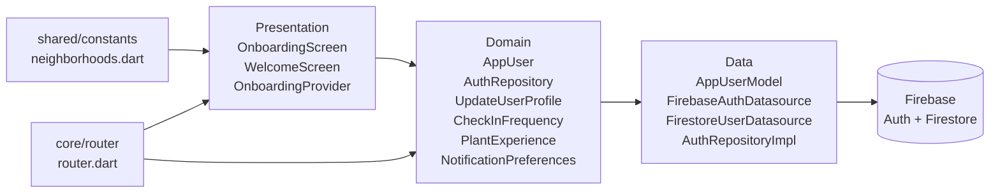

# SPEC-0001: Authentication and Onboarding Flow

**Status:** APPROVED  
**Author:**  
**Date:** 2026-06-03  
**Proposal:** [PROP-0001](../tech-proposals/0001-authentication.md)  
**Approved by:** Slade

---

## Overview

The boilerplate ships a complete Firebase Auth stack wired to Clean Architecture. Its domain vocabulary is Unishare-specific: `AppUser` carries `universityId`, `departmentId`, `enrollmentYear`, `bio`, and `role: 'student'`; the Firestore datasource reads `universities` and `departments` collections; and the welcome screen renders a university dropdown. This spec directs the surgical replacement of all Unishare-specific artifacts with Canopy-specific equivalents, and adds a 4-step onboarding quiz that every new registered user must complete before reaching the main shell. Guest users are unaffected; returning users whose `onboardingComplete` flag is already `true` skip the quiz.

---

## Architecture



The Domain layer has zero Flutter or Firebase imports. The Presentation layer depends only on Domain interfaces — never on Data classes directly. `OnboardingScreen` reads quiz state from `OnboardingNotifier` (Presentation) and calls `UpdateUserProfile` (Domain use case) through the repository provider on final submission.

---

## File map

| Action | Path | Responsibility |
|---|---|---|
| Modify | `lib/features/auth/domain/entities/app_user.dart` | Replace all Unishare fields with Canopy fields; add `neighborhood`, `checkInFrequency`, `plantExperience`, `notificationPreferences`, `onboardingComplete` |
| Create | `lib/features/auth/domain/entities/check_in_frequency.dart` | Pure Dart enum: `mostDays`, `onceAWeek`, `twiceAMonth` |
| Create | `lib/features/auth/domain/entities/plant_experience.dart` | Pure Dart enum: `beginner`, `houseplant`, `backyardGardener`, `professional` |
| Create | `lib/features/auth/domain/entities/notification_preferences.dart` | Pure Dart value class with two bool flags |
| Modify | `lib/features/auth/domain/repositories/auth_repository.dart` | Remove `updateAcademicProfile`; remove `universityId` param from `signUpWithEmail`; replace `updateProfile` with `updateUserProfile`; add `linkAnonymousAccount` |
| Create | `lib/features/auth/domain/usecases/update_user_profile.dart` | Single-responsibility use case delegating to `AuthRepository.updateUserProfile` |
| Delete | `lib/features/auth/domain/usecases/update_academic_profile.dart` | No longer required |
| Keep | `lib/features/auth/domain/usecases/sign_in_with_email.dart` | No changes |
| Modify | `lib/features/auth/domain/usecases/sign_up_with_email.dart` | Remove `universityId` parameter |
| Keep | `lib/features/auth/domain/usecases/sign_in_with_google.dart` | No changes |
| Keep | `lib/features/auth/domain/usecases/sign_out.dart` | No changes |
| Keep | `lib/features/auth/domain/usecases/get_current_user.dart` | No changes |
| Modify | `lib/features/auth/data/models/app_user_model.dart` | Replace Unishare JSON fields with Canopy fields; update `fromFirestore` and `toEntity` accordingly |
| Modify | `lib/features/auth/data/datasources/firebase_auth_datasource.dart` | Add `linkWithCredential(AuthCredential)` method |
| Modify | `lib/features/auth/data/datasources/firestore_user_datasource.dart` | Replace `universityId`/`departmentId`/`enrollmentYear`/`bio`/`role` with Canopy fields; remove `_universities`, `_departments` collection refs and all related methods; add `updateUserProfile`; batch-write onboarding fields on final step only |
| Modify | `lib/features/auth/data/repositories/auth_repository_impl.dart` | Implement `updateUserProfile`, `linkAnonymousAccount`; remove `updateAcademicProfile`; remove `universityId` from `signUpWithEmail` |
| Modify | `lib/features/auth/presentation/screens/welcome_screen.dart` | Remove university dropdown and `universitiesProvider` watch; update subheading copy; update email hint text; remove Microsoft sign-in button (Unishare-only) |
| Create | `lib/features/auth/presentation/screens/onboarding_screen.dart` | Full-screen 4-step quiz; reads `OnboardingNotifier`; calls `UpdateUserProfile` on final CTA |
| Delete | `lib/features/auth/presentation/widgets/academic_profile_dialog.dart` | No longer required |
| Create | `lib/features/auth/presentation/widgets/onboarding_step_neighborhood.dart` | Step 2 widget: neighborhood chip-selection list |
| Create | `lib/features/auth/presentation/widgets/onboarding_step_frequency.dart` | Step 3 widget: check-in frequency choice cards |
| Create | `lib/features/auth/presentation/widgets/onboarding_step_experience.dart` | Step 4 widget: plant experience choice cards |
| Keep | `lib/features/auth/presentation/providers/auth_repository_provider.dart` | No changes |
| Keep | `lib/features/auth/presentation/providers/auth_state_provider.dart` | No changes |
| Keep | `lib/features/auth/presentation/providers/current_user_provider.dart` | No changes |
| Keep | `lib/features/auth/presentation/providers/guest_mode_provider.dart` | No changes |
| Delete | `lib/features/auth/presentation/providers/departments_provider.dart` | No longer required |
| Delete | `lib/features/auth/presentation/providers/universities_provider.dart` | No longer required |
| Create | `lib/features/auth/presentation/providers/onboarding_provider.dart` | `OnboardingNotifier` holding in-memory quiz state during the flow |
| Create | `lib/shared/constants/neighborhoods.dart` | `const List<String> kNeighborhoods` — hardcoded district list |
| Modify | `lib/core/router/router.dart` | Add `/onboarding` route; extend redirect guard for the three routing cases |

---

## Firestore schema

### Document: `users/{uid}`

All reads and writes go through `FirestoreUserDatasource`. No sub-collections are touched by this feature.

#### Fields added (Canopy)

| Field | Firestore type | Dart type | Nullable | Notes |
|---|---|---|---|---|
| `neighborhood` | `string` | `String?` | yes | One of the values in `kNeighborhoods`; null until onboarding complete or skipped |
| `checkInFrequency` | `string` | `String?` | yes | Serialised enum name: `"mostDays"`, `"onceAWeek"`, `"twiceAMonth"`; null if skipped |
| `plantExperience` | `string` | `String?` | yes | Serialised enum name: `"beginner"`, `"houseplant"`, `"backyardGardener"`, `"professional"`; null if skipped |
| `notificationPreferences` | `map` | `NotificationPreferences` | no | Written at account creation with both flags `false`; never null |
| `notificationPreferences.wateringReminders` | `boolean` | `bool` | no | User opts in to watering reminders |
| `notificationPreferences.cityAlerts` | `boolean` | `bool` | no | User opts in to city forestry alerts |
| `onboardingComplete` | `boolean` | `bool` | no | Written `true` when user taps "Find me a tree" or skips the final step; default `false` at account creation |
| `createdAt` | `timestamp` | — | no | Set via `FieldValue.serverTimestamp()` on account creation; already present in boilerplate |

#### Fields removed (Unishare)

The following fields must not be written on new documents and must not be read by any Dart code after this spec is implemented. Existing documents in development Firestore can be left as-is; the `fromFirestore` mapper simply ignores unknown keys.

| Field removed | Previous Dart type |
|---|---|
| `universityId` | `String?` |
| `departmentId` | `String?` |
| `enrollmentYear` | `int?` |
| `bio` | `String?` |
| `role` | `String` (default `'student'`) |

#### Fields unchanged

`id` (document key), `name`, `email`, `photoUrl`, `createdAt`.

#### Onboarding batch write

When the user taps "Find me a tree" on step 4 (or taps Skip on any step and then completes the quiz), a single `DocumentReference.update()` call writes the following fields atomically:

```
neighborhood         → String? (null if skipped)
checkInFrequency     → String? (null if skipped)
plantExperience      → String? (null if skipped)
onboardingComplete   → true
```

This is not a batched `WriteBatch` object (only one document is written), but all four fields are written in a single `update()` call so the Firestore listener never sees a partial state.

---

## API contracts

### `AppUser` entity

```dart
// lib/features/auth/domain/entities/app_user.dart
// Pure Dart — zero Flutter or Firebase imports.
import 'package:canopy/features/auth/domain/entities/check_in_frequency.dart';
import 'package:canopy/features/auth/domain/entities/plant_experience.dart';
import 'package:canopy/features/auth/domain/entities/notification_preferences.dart';

class AppUser {
  const AppUser({
    required this.id,
    required this.name,
    required this.email,
    this.photoUrl,
    this.neighborhood,
    this.checkInFrequency,
    this.plantExperience,
    NotificationPreferences? notificationPreferences,
    this.onboardingComplete = false,
    this.providerIds = const <String>[],
    this.isAnonymous = false,
  }) : notificationPreferences =
           notificationPreferences ?? const NotificationPreferences();

  final String id;
  final String name;
  final String email;
  final String? photoUrl;

  // Canopy-specific profile fields
  final String? neighborhood;
  final CheckInFrequency? checkInFrequency;
  final PlantExperience? plantExperience;
  final NotificationPreferences notificationPreferences;
  final bool onboardingComplete;

  // Auth metadata
  final List<String> providerIds;
  final bool isAnonymous;
}
```

### `CheckInFrequency` enum

```dart
// lib/features/auth/domain/entities/check_in_frequency.dart
enum CheckInFrequency {
  mostDays,
  onceAWeek,
  twiceAMonth;

  /// Human-readable label shown in the onboarding UI.
  String get label => switch (this) {
    CheckInFrequency.mostDays    => 'Most days',
    CheckInFrequency.onceAWeek   => 'Once a week',
    CheckInFrequency.twiceAMonth => 'Twice a month',
  };
}
```

### `PlantExperience` enum

```dart
// lib/features/auth/domain/entities/plant_experience.dart
enum PlantExperience {
  beginner,
  houseplant,
  backyardGardener,
  professional;

  String get label => switch (this) {
    PlantExperience.beginner        => 'Beginner',
    PlantExperience.houseplant      => 'Houseplant keeper',
    PlantExperience.backyardGardener => 'Backyard gardener',
    PlantExperience.professional    => 'Professional',
  };
}
```

### `NotificationPreferences` value class

```dart
// lib/features/auth/domain/entities/notification_preferences.dart
class NotificationPreferences {
  const NotificationPreferences({
    this.wateringReminders = false,
    this.cityAlerts = false,
  });

  final bool wateringReminders;
  final bool cityAlerts;

  NotificationPreferences copyWith({
    bool? wateringReminders,
    bool? cityAlerts,
  }) => NotificationPreferences(
    wateringReminders: wateringReminders ?? this.wateringReminders,
    cityAlerts: cityAlerts ?? this.cityAlerts,
  );
}
```

### `AuthRepository` interface

```dart
// lib/features/auth/domain/repositories/auth_repository.dart
import 'package:canopy/features/auth/domain/entities/app_user.dart';
import 'package:canopy/features/auth/domain/entities/notification_preferences.dart';
import 'package:canopy/features/auth/domain/entities/check_in_frequency.dart';
import 'package:canopy/features/auth/domain/entities/plant_experience.dart';

abstract interface class AuthRepository {
  /// Emits null when signed out, AppUser when signed in (including anonymous).
  Stream<AppUser?> get authStateChanges;

  Future<AppUser> signInAnonymously();

  Future<AppUser> signInWithGoogle();

  Future<AppUser> signInWithEmail({
    required String email,
    required String password,
  });

  /// [universityId] parameter removed. [name] is stored on the Firestore
  /// user document and on the Firebase Auth displayName.
  Future<AppUser> signUpWithEmail({
    required String name,
    required String email,
    required String password,
  });

  Future<void> signOut();

  Future<AppUser?> getCurrentUser();

  /// Updates mutable profile fields. All parameters are optional; pass only
  /// the fields that have changed.
  Future<void> updateUserProfile({
    required String uid,
    String? name,
    String? neighborhood,
    CheckInFrequency? checkInFrequency,
    PlantExperience? plantExperience,
    NotificationPreferences? notificationPreferences,
    bool? onboardingComplete,
  });

  /// Merges an anonymous session into a permanent account by linking the
  /// given credential. Returns the upgraded AppUser.
  /// Throws [AuthException] with type [AuthFailureType.emailAlreadyInUse]
  /// if the credential belongs to an existing account.
  Future<AppUser> linkAnonymousAccount({
    required String uid,
    required Object credential, // firebase_auth.AuthCredential at runtime
  });
}
```

> Note on `linkAnonymousAccount` credential type: the domain interface declares the parameter as `Object` to preserve the zero-Firebase-import rule. The Data layer implementation (`AuthRepositoryImpl`) casts to `firebase_auth.AuthCredential`. This is an intentional layer seam — the same pattern used by the existing boilerplate for `User`.

### `UpdateUserProfile` use case

```dart
// lib/features/auth/domain/usecases/update_user_profile.dart
import 'package:canopy/features/auth/domain/repositories/auth_repository.dart';
import 'package:canopy/features/auth/domain/entities/check_in_frequency.dart';
import 'package:canopy/features/auth/domain/entities/plant_experience.dart';
import 'package:canopy/features/auth/domain/entities/notification_preferences.dart';

class UpdateUserProfile {
  const UpdateUserProfile(this._repository);

  final AuthRepository _repository;

  Future<void> call({
    required String uid,
    String? name,
    String? neighborhood,
    CheckInFrequency? checkInFrequency,
    PlantExperience? plantExperience,
    NotificationPreferences? notificationPreferences,
    bool? onboardingComplete,
  }) => _repository.updateUserProfile(
    uid: uid,
    name: name,
    neighborhood: neighborhood,
    checkInFrequency: checkInFrequency,
    plantExperience: plantExperience,
    notificationPreferences: notificationPreferences,
    onboardingComplete: onboardingComplete,
  );
}
```

### `OnboardingState` and `OnboardingNotifier`

```dart
// lib/features/auth/presentation/providers/onboarding_provider.dart

/// In-memory quiz state held during the onboarding flow.
/// Nothing is persisted until the user taps "Find me a tree".
class OnboardingState {
  const OnboardingState({
    this.currentStep = 0,           // 0-indexed; 0 = welcome, 3 = experience
    this.selectedNeighborhood,
    this.selectedFrequency,
    this.selectedExperience,
    this.isSubmitting = false,
    this.submitError,
  });

  final int currentStep;
  final String? selectedNeighborhood;
  final CheckInFrequency? selectedFrequency;
  final PlantExperience? selectedExperience;
  final bool isSubmitting;
  final String? submitError;                // non-null when Firestore write failed

  OnboardingState copyWith({ ... });        // standard copyWith
}

@riverpod
class OnboardingNotifier extends _$OnboardingNotifier {
  @override
  OnboardingState build() => const OnboardingState();

  void nextStep();
  void previousStep();
  void selectNeighborhood(String neighborhood);
  void selectFrequency(CheckInFrequency frequency);
  void selectExperience(PlantExperience experience);

  /// Writes the collected answers to Firestore in a single update() call.
  /// Sets onboardingComplete: true regardless of which fields were skipped.
  /// On success the router redirect re-evaluates and navigates to /grove.
  /// On failure sets [OnboardingState.submitError]; caller shows retry UI.
  Future<void> submit(String uid);
}
```

### Neighborhoods constant

```dart
// lib/shared/constants/neighborhoods.dart

/// Hardcoded district list. Add entries here to extend without a Firestore
/// collection or backend change. Order is the display order in the UI.
const List<String> kNeighborhoods = [
  'Maple Heights',
  'East Park',
  'Westgate',
  'Riverside',
];
```

### GoRouter redirect logic

```dart
// lib/core/router/router.dart  — redirect method (pseudo-code showing three cases)

String? redirect(BuildContext context, GoRouterState state) {
  // Hold redirects while Firebase session is restoring.
  if (!authAsync.hasValue) return null;

  final isAuthenticated = authAsync.value != null && !authAsync.value!.isAnonymous;
  final isGuest = isAuthenticated == false && guestModeProvider == true;
  final user = authAsync.value;
  final path = state.uri.path;

  // Case 1: No session and not a guest → /welcome.
  if (!isAuthenticated && !isGuest) {
    return path == '/welcome' ? null : '/welcome?redirect=${Uri.encodeComponent(path)}';
  }

  // Case 2: Authenticated, onboarding incomplete → /onboarding.
  // Guest users are exempt — they have no onboarding record.
  if (isAuthenticated && user!.onboardingComplete == false) {
    return path == '/onboarding' ? null : '/onboarding';
  }

  // Case 3: Authenticated, onboarding complete, sitting on an auth/onboarding
  // route → honour redirect param or default to /grove.
  if (isAuthenticated && {'/welcome', '/onboarding'}.contains(path)) {
    final redirectParam = state.uri.queryParameters['redirect'];
    if (redirectParam != null && redirectParam.startsWith('/') &&
        !redirectParam.contains('://')) {
      return redirectParam;
    }
    return '/grove';
  }

  // Case 3b: Guest on /welcome → /grove.
  if (isGuest && path == '/welcome') return '/grove';

  // Root → /grove.
  if (path == '/') return '/grove';

  return null;
}
```

The `/onboarding` route is added as a top-level `GoRoute` (not inside the `StatefulShellRoute`) so the bottom navigation bar is not visible during onboarding:

```dart
GoRoute(
  path: '/onboarding',
  builder: (context, state) => const OnboardingScreen(),
),
```

---

## Error states

| Trigger | Where surfaced | Recovery |
|---|---|---|
| `AuthFailureType.emailAlreadyInUse` on sign-up | Inline below the email field in `WelcomeScreen` | User edits email or switches to sign-in |
| `AuthFailureType.invalidCredentials` on sign-in | Inline below the password field in `WelcomeScreen` | User corrects credentials |
| Google Sign-In cancelled | Silently dismissed — no error toast | No action required |
| `AuthFailureType.networkError` on any auth attempt | Inline `_serverError` banner below the form | User retries when connectivity returns |
| Firestore write failure on onboarding submit | `OnboardingState.submitError` non-null → `OnboardingScreen` shows inline retry button | User taps retry; `OnboardingNotifier.submit()` is called again |

---

## Onboarding quiz step definitions

| Step index | Route segment | Widget | Content |
|---|---|---|---|
| 0 | — | Inline in `OnboardingScreen` | Welcome/intro copy; no input required; Next CTA |
| 1 | — | `OnboardingStepNeighborhood` | Chip list from `kNeighborhoods`; single-select; skip allowed |
| 2 | — | `OnboardingStepFrequency` | Three choice cards from `CheckInFrequency.values`; single-select; skip allowed |
| 3 | — | `OnboardingStepExperience` | Four choice cards from `PlantExperience.values`; single-select; final CTA "Find me a tree" triggers `OnboardingNotifier.submit()` |

All four steps live inside a single `OnboardingScreen` (a `PageView` or indexed stack controlled by `OnboardingNotifier.currentStep`). The screen is a single `/onboarding` route — no nested routes. Back navigation on step 0 is disabled; steps 1-3 show a back button that calls `OnboardingNotifier.previousStep()`. Skip on steps 1-3 leaves the corresponding field null and advances to the next step.

---

## Acceptance criteria

Taken directly from the approved proposal. Implementation is complete when all of the following pass:

1. A user can create an account with email + password; the account persists across app restarts.
2. A user can sign in with Google; a new Firestore user document is created on first Google sign-in and not re-created on subsequent sign-ins.
3. A guest user can open the app, browse the map, and view tree profiles without creating an account.
4. When a guest user attempts to adopt a tree they are redirected to `/welcome`; after completing sign-up they are returned to the adoption context via the `redirect` query parameter.
5. After sign-up (email or Google, first time only), the router sends the user to `/onboarding` before any tab of the main shell is shown.
6. The onboarding quiz has exactly 4 steps: welcome, neighborhood, check-in frequency, plant experience.
7. Tapping "Find me a tree" on step 3 writes `onboardingComplete: true` (and whichever quiz fields were selected) to the Firestore user document in a single `update()` call, then navigates to `/grove` via the redirect guard.
8. Skipping all steps still writes `onboardingComplete: true` and navigates to `/grove`.
9. A returning registered user whose `onboardingComplete == true` goes directly to `/grove` on launch without seeing the quiz.
10. `grep -r "universityId\|departmentId\|enrollmentYear\|bio.*String\|role.*student" apps/mobile/lib/features/auth/domain` returns zero results.
11. `departments_provider.dart`, `universities_provider.dart`, and `academic_profile_dialog.dart` do not exist in the delivered code.
12. `AuthRepository` contains no reference to `updateAcademicProfile`.
13. `flutter analyze` reports zero errors on `lib/features/auth/` and `lib/shared/constants/`.
14. Every new screen (`onboarding_screen.dart`, modified `welcome_screen.dart`) has a corresponding widget test.
15. The router redirect correctly handles all three cases: unauthenticated non-guest to `/welcome`, authenticated + `onboardingComplete == false` to `/onboarding`, authenticated + `onboardingComplete == true` through to the intended route.

---

## Test plan

| Test file | Type | Covers |
|---|---|---|
| `test/unit/features/auth/domain/usecases/update_user_profile_test.dart` | Unit | `UpdateUserProfile.call` delegates all parameters to `AuthRepository.updateUserProfile`; mock verifies exact arguments |
| `test/unit/features/auth/domain/usecases/sign_up_with_email_test.dart` | Unit | `SignUpWithEmail.call` no longer passes `universityId`; mock verifies absence of that argument |
| `test/unit/features/auth/domain/entities/app_user_test.dart` | Unit | `AppUser` default values: `onboardingComplete == false`, `notificationPreferences` is non-null with both flags false, `isAnonymous == false` |
| `test/unit/features/auth/domain/entities/check_in_frequency_test.dart` | Unit | Each enum value returns the expected `label` string |
| `test/unit/features/auth/domain/entities/plant_experience_test.dart` | Unit | Each enum value returns the expected `label` string |
| `test/unit/features/auth/data/models/app_user_model_test.dart` | Unit | `fromFirestore` correctly maps all Canopy fields; documents with legacy Unishare fields do not throw; `toEntity` produces a correct `AppUser` |
| `test/unit/features/auth/data/repositories/auth_repository_impl_test.dart` | Unit | `updateUserProfile` calls `FirestoreUserDatasource.updateUserProfile` with correct args; `linkAnonymousAccount` calls `FirebaseAuthDatasource.linkWithCredential`; `signUpWithEmail` no longer passes `universityId` to the datasource |
| `test/unit/features/auth/presentation/providers/onboarding_provider_test.dart` | Unit | State transitions: `nextStep` increments index; `previousStep` decrements; `selectNeighborhood`/`selectFrequency`/`selectExperience` set the correct fields; `submit` sets `isSubmitting` true, calls `UpdateUserProfile`, then clears `isSubmitting`; on failure sets `submitError` |
| `test/unit/core/router/router_redirect_test.dart` | Unit | Case 1: unauthenticated non-guest on `/grove` redirects to `/welcome?redirect=%2Fgrove`; Case 2: authenticated user with `onboardingComplete == false` on `/grove` redirects to `/onboarding`; Case 3: authenticated user with `onboardingComplete == true` on `/onboarding` redirects to `/grove`; authenticated user with `onboardingComplete == true` on `/grove` returns null (no redirect) |
| `test/unit/shared/constants/neighborhoods_test.dart` | Unit | `kNeighborhoods` contains exactly the four specified district strings and has no duplicates |
| `test/widget/features/auth/presentation/screens/welcome_screen_test.dart` | Widget | University dropdown absent; email hint text does not contain "university"; sign-in form submits and shows inline error on `AuthFailureType.invalidCredentials`; Google cancel is silent; "Continue as guest" button present |
| `test/widget/features/auth/presentation/screens/onboarding_screen_test.dart` | Widget | Step 0 renders welcome copy and Next button; tapping Next advances to step 1; step 1 renders all four neighbourhood chips; selecting a chip and tapping Next advances to step 2; Skip on step 1 advances without selecting a neighbourhood; step 3 renders "Find me a tree" CTA; tapping CTA while `isSubmitting == true` disables the button; `submitError` non-null renders a retry button |

---

## Out of scope

Taken from the Non-Goals section of PROP-0001:

- Apple Sign-In
- Phone / SMS authentication
- Biometric (Face ID / fingerprint) authentication
- Two-factor authentication
- In-app password reset flow (Firebase's default email reset link is acceptable)
- Social features (following users, sharing a grove)
- Admin or forestry-team role management
- In-app notification delivery (preferences are stored here; delivery is a separate feature)
- Migration of existing Firestore documents that carry Unishare fields (development data; no production users exist yet)
- Microsoft Sign-In button (present in the current boilerplate `WelcomeScreen`; removal is included in scope but re-implementation is out of scope)

---

## Open questions

None — all questions raised in PROP-0001 are resolved prior to this spec:

1. **Firestore field types** — resolved: `checkInFrequency` and `plantExperience` are stored as Firestore `string` containing the Dart enum name (e.g., `"mostDays"`). This keeps the document human-readable and avoids ordinal-fragility.
2. **Onboarding write timing** — resolved: single batch `update()` on final CTA only.
3. **Guest upgrade path** — resolved: `FirebaseAuth.linkWithCredential` via `AuthRepository.linkAnonymousAccount`.
4. **Skip behaviour** — resolved: skipped fields are written as `null`; `onboardingComplete` is set `true` regardless. Downstream features (tree recommendations, reminders) must treat null onboarding fields as "no preference" — this is their responsibility to handle, not auth's.
5. **Neighborhood data source** — resolved: hardcoded `const List<String> kNeighborhoods` in `lib/shared/constants/neighborhoods.dart`.
6. **`notificationPreferences` schema** — resolved: two bool flags (`wateringReminders`, `cityAlerts`) stored as a Firestore map.
