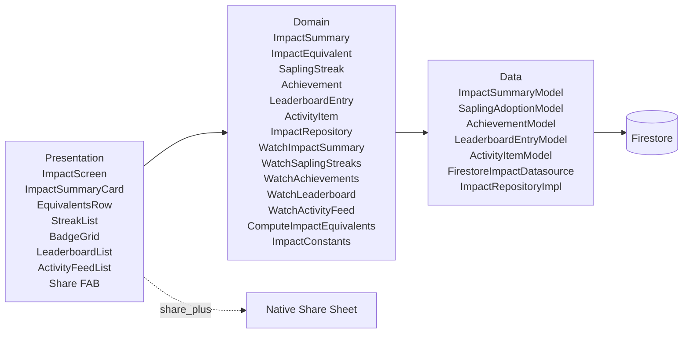

# SPEC-0002: Impact Dashboard

**Status:** DRAFT
**Author:** Architect Agent
**Date:** 2026-06-04
**Proposal:** [PROP-0002](../tech-proposals/0002-impact.md)
**Approved by:** (pending)

---

## Overview

The Impact feature replaces the `ImpactScreen` placeholder with a scrollable personal environmental dashboard. It reads pre-computed impact data from a set of Firestore sub-collections (summary, sapling adoptions, achievements, leaderboard, activity feed), renders real-world equivalents derived in memory, and surfaces a native share sheet. All metric computation runs in pure Dart use cases; the data layer handles only Firestore serialization and streaming. The feature follows the same Clean Architecture layering as `features/auth`.

---

## Architecture



The Domain layer has zero Flutter or Firebase imports. The Presentation layer depends only on Domain interfaces. The Data layer is the only layer that imports `cloud_firestore`. `share_plus` is called directly from the Presentation layer (it is a UI concern, not a domain concern).

---

## File map

| Action | Path | Responsibility |
|---|---|---|
| Modify | `lib/features/impact/presentation/screens/impact_screen.dart` | Replace placeholder with full scrollable dashboard; consume all six providers |
| Create | `lib/features/impact/domain/entities/impact_summary.dart` | Pure Dart entity: co2OffsetKg, waterGivenLiters, totalSurvivalDays, lastUpdated |
| Create | `lib/features/impact/domain/entities/impact_equivalent.dart` | Pure Dart value object: label, value, unit, iconName — never stored, always derived |
| Create | `lib/features/impact/domain/entities/sapling_streak.dart` | Pure Dart entity: saplingId, nickname, streakDays, lastCheckIn, isActive |
| Create | `lib/features/impact/domain/entities/achievement.dart` | Pure Dart entity: id, title, description, iconName, earnedAt |
| Create | `lib/features/impact/domain/entities/leaderboard_entry.dart` | Pure Dart entity: userId, displayName, neighborhood, co2OffsetKg, rank |
| Create | `lib/features/impact/domain/entities/activity_item.dart` | Pure Dart entity: id, type, description, timestamp, saplingNickname? |
| Create | `lib/features/impact/domain/entities/activity_type.dart` | Pure Dart enum: adopted, watered, milestoneReached |
| Create | `lib/features/impact/domain/constants/impact_constants.dart` | CO₂ rate, water per check-in, equivalent conversion factors |
| Create | `lib/features/impact/domain/repositories/impact_repository.dart` | Abstract interface with five Stream-returning methods |
| Create | `lib/features/impact/domain/usecases/watch_impact_summary.dart` | Delegates to ImpactRepository.watchImpactSummary |
| Create | `lib/features/impact/domain/usecases/watch_sapling_streaks.dart` | Delegates to ImpactRepository.watchSaplingStreaks |
| Create | `lib/features/impact/domain/usecases/watch_achievements.dart` | Delegates to ImpactRepository.watchAchievements |
| Create | `lib/features/impact/domain/usecases/watch_leaderboard.dart` | Delegates to ImpactRepository.watchLeaderboard |
| Create | `lib/features/impact/domain/usecases/watch_activity_feed.dart` | Delegates to ImpactRepository.watchActivityFeed |
| Create | `lib/features/impact/domain/usecases/compute_impact_equivalents.dart` | Pure synchronous function; derives List<ImpactEquivalent> from ImpactSummary |
| Create | `lib/features/impact/data/models/impact_summary_model.dart` | Freezed model; fromFirestore / toEntity |
| Create | `lib/features/impact/data/models/sapling_adoption_model.dart` | Freezed model; fromFirestore / toEntity (maps to SaplingStreak) |
| Create | `lib/features/impact/data/models/achievement_model.dart` | Freezed model; fromFirestore / toEntity |
| Create | `lib/features/impact/data/models/leaderboard_entry_model.dart` | Freezed model; fromFirestore / toEntity |
| Create | `lib/features/impact/data/models/activity_item_model.dart` | Freezed model; fromFirestore / toEntity |
| Create | `lib/features/impact/data/datasources/firestore_impact_datasource.dart` | All Firestore reads; returns model streams |
| Create | `lib/features/impact/data/repositories/impact_repository_impl.dart` | Implements ImpactRepository; maps models to entities |
| Create | `lib/features/impact/presentation/providers/impact_providers.dart` | All six Riverpod providers (StreamProvider × 5 + derived Provider) |
| Create | `lib/features/impact/presentation/widgets/impact_summary_card.dart` | Top card: CO₂, water, survival days |
| Create | `lib/features/impact/presentation/widgets/equivalents_row.dart` | Horizontal row of ImpactEquivalent chips |
| Create | `lib/features/impact/presentation/widgets/streak_list.dart` | Vertical list of SaplingStreak tiles |
| Create | `lib/features/impact/presentation/widgets/badge_grid.dart` | Wrap grid of earned Achievement badges |
| Create | `lib/features/impact/presentation/widgets/leaderboard_list.dart` | Ranked list of LeaderboardEntry tiles (top 20) |
| Create | `lib/features/impact/presentation/widgets/activity_feed_list.dart` | Chronological list of ActivityItem tiles (last 20) |
| Modify | `pubspec.yaml` | Add `share_plus` dependency |
| Modify | `firestore.rules` | Add rules for the four new collections/sub-collections |
| Modify | `firestore.indexes.json` | Add composite indexes for leaderboard and activity feed queries |

---

## Firestore schema

### Document: `users/{uid}/impactSummary/current`

A single document (fixed ID `current`) under each user. Written by the client whenever a sapling is adopted or a watering check-in is logged. All fields are numeric and updated with Firestore increment or a full overwrite on the client.

| Field | Firestore type | Dart type | Notes |
|---|---|---|---|
| `co2OffsetKg` | `number` | `double` | Running total; incremented by `kCo2KgPerSaplingPerDay` each day a sapling is alive |
| `waterGivenLiters` | `number` | `double` | Running total; incremented by `kWaterLitersPerCheckIn` on each watering |
| `totalSurvivalDays` | `number` | `int` | Sum of alive days across all adopted saplings |
| `lastUpdated` | `timestamp` | `DateTime` | Set to server timestamp on every write |

Security: owner-read-write only (same rule as `users/{uid}`).

---

### Document: `users/{uid}/saplingAdoptions/{saplingId}`

One document per adopted sapling. The Grove/Care feature owns the write path; Impact reads from it. Fields required by the Impact feature are listed here; the Grove feature may add more.

| Field | Firestore type | Dart type | Notes |
|---|---|---|---|
| `saplingId` | `string` | `String` | Same as the document key; denormalized for convenience |
| `nickname` | `string` | `String` | User-assigned name for the sapling |
| `streakDays` | `number` | `int` | Consecutive daily check-ins; reset to 0 when gap > wateringIntervalDays + 1 |
| `lastCheckIn` | `timestamp` | `DateTime?` | Timestamp of most recent watering check-in; null if never watered |
| `adoptedAt` | `timestamp` | `DateTime` | Timestamp of adoption event |
| `wateringIntervalDays` | `number` | `int` | From the Sapling species definition; determines lapse threshold |

Security: owner-read-write only.

`isActive` (whether the streak is current) is computed in the domain layer by comparing `lastCheckIn` to `DateTime.now()` against the `wateringIntervalDays` threshold. It is not stored.

---

### Document: `users/{uid}/achievements/{achievementId}`

One document per earned badge. Written idempotently by the client when an eligibility threshold is crossed.

| Field | Firestore type | Dart type | Notes |
|---|---|---|---|
| `id` | `string` | `String` | Same as document key; one of the badge IDs in the table below |
| `title` | `string` | `String` | Display name |
| `description` | `string` | `String` | Short description |
| `iconName` | `string` | `String` | Asset name key (resolved to SVG path in the widget layer) |
| `earnedAt` | `timestamp` | `DateTime` | Set to server timestamp on first write; never updated |

Security: owner-read-write only. The client may only write its own achievement documents.

#### Badge definitions

| Badge ID | Title | Threshold |
|---|---|---|
| `first_adopter` | First Adopter | At least 1 sapling adopted |
| `week_warrior` | Week Warrior | Any single sapling streak >= 7 days |
| `month_milestone` | Month Milestone | Any single sapling streak >= 30 days |
| `carbon_hero` | Carbon Hero | `co2OffsetKg >= 10.0` |
| `water_guardian` | Water Guardian | `waterGivenLiters >= 100.0` |
| `neighborhood_champion` | Neighborhood Champion | User appears in top 3 of their neighborhood leaderboard |

---

### Document: `neighborhoodLeaderboard/{neighborhood}/entries/{uid}`

One document per user per neighborhood. Written by the client when the user's impact summary is updated. The `{neighborhood}` segment is the URL-encoded value of `AppUser.neighborhood`. Only the top 20 are read by the client (ordered by `co2OffsetKg` descending, limit 20).

| Field | Firestore type | Dart type | Notes |
|---|---|---|---|
| `userId` | `string` | `String` | Same as document key |
| `displayName` | `string` | `String` | From `AppUser.name`; denormalized |
| `neighborhood` | `string` | `String` | Redundant with path segment; denormalized for query convenience |
| `co2OffsetKg` | `number` | `double` | Kept in sync with the user's impact summary |
| `lastUpdated` | `timestamp` | `DateTime` | Server timestamp; used to break ties |

Security rule: a user may read any document in a neighborhood's `entries` sub-collection (public leaderboard read), but may only write the document whose key matches their own UID.

Required composite index: `neighborhoodLeaderboard/{neighborhood}/entries` — `co2OffsetKg` DESCENDING, `lastUpdated` DESCENDING.

---

### Document: `users/{uid}/activityFeed/{activityId}`

One document per activity event. Written by the Grove/Care feature (adopt, water) and by the Impact feature when a badge is earned. Impact reads the last 20 ordered by `timestamp` descending.

| Field | Firestore type | Dart type | Notes |
|---|---|---|---|
| `id` | `string` | `String` | Same as document key; auto-ID |
| `type` | `string` | `String` | Serialized `ActivityType` enum: `"adopted"`, `"watered"`, `"milestoneReached"` |
| `description` | `string` | `String` | Human-readable event text, e.g. "You adopted Mango Tree" |
| `timestamp` | `timestamp` | `DateTime` | Server timestamp at event time |
| `saplingNickname` | `string` | `String?` | Nullable; populated for adopt and water events |

Security: owner-read-write only.

Required composite index: `users/{uid}/activityFeed` — `timestamp` DESCENDING.

---

## CO₂ and water constants

All constants live in `lib/features/impact/domain/constants/impact_constants.dart`. This is a pure Dart file — no imports.

| Constant | Value | Basis |
|---|---|---|
| `kCo2KgPerSaplingPerDay` | `0.0575` | ~21 kg CO₂/year ÷ 365 days, rounded |
| `kWaterLitersPerCheckIn` | `2.0` | One watering event |
| `kCo2KgPerCarMile` | `0.259` | US EPA average; 1 kg CO₂ offset = 3.86 miles |
| `kLitersPerShower` | `2.0` | Approximate 2-minute shower |

The equivalents computed by `ComputeImpactEquivalents`:
- Car miles offset: `co2OffsetKg / kCo2KgPerCarMile`
- Showers saved: `waterGivenLiters / kLitersPerShower`

---

## API contracts

### `ImpactSummary` entity

```dart
// lib/features/impact/domain/entities/impact_summary.dart
// Pure Dart — zero Flutter or Firebase imports.
class ImpactSummary {
  const ImpactSummary({
    required this.co2OffsetKg,
    required this.waterGivenLiters,
    required this.totalSurvivalDays,
    required this.lastUpdated,
  });

  final double co2OffsetKg;
  final double waterGivenLiters;
  final int totalSurvivalDays;
  final DateTime lastUpdated;
}
```

### `ImpactEquivalent` entity

```dart
// lib/features/impact/domain/entities/impact_equivalent.dart
// Not stored in Firestore. Always derived by ComputeImpactEquivalents.
class ImpactEquivalent {
  const ImpactEquivalent({
    required this.label,
    required this.value,
    required this.unit,
    required this.iconName,
  });

  final String label;
  final double value;
  final String unit;
  final String iconName; // asset key resolved in widget layer
}
```

### `SaplingStreak` entity

```dart
// lib/features/impact/domain/entities/sapling_streak.dart
class SaplingStreak {
  const SaplingStreak({
    required this.saplingId,
    required this.nickname,
    required this.streakDays,
    required this.lastCheckIn,
    required this.isActive,
  });

  final String saplingId;
  final String nickname;
  final int streakDays;
  final DateTime? lastCheckIn;
  /// True when DateTime.now() - lastCheckIn <= wateringIntervalDays + 1.
  /// Computed in the repository mapper; never stored.
  final bool isActive;
}
```

### `Achievement` entity

```dart
// lib/features/impact/domain/entities/achievement.dart
class Achievement {
  const Achievement({
    required this.id,
    required this.title,
    required this.description,
    required this.iconName,
    required this.earnedAt,
  });

  final String id;
  final String title;
  final String description;
  final String iconName;
  final DateTime earnedAt;
}
```

### `LeaderboardEntry` entity

```dart
// lib/features/impact/domain/entities/leaderboard_entry.dart
class LeaderboardEntry {
  const LeaderboardEntry({
    required this.userId,
    required this.displayName,
    required this.neighborhood,
    required this.co2OffsetKg,
    required this.rank,
  });

  final String userId;
  final String displayName;
  final String neighborhood;
  final double co2OffsetKg;
  /// 1-based rank assigned by the repository after receiving the ordered list.
  final int rank;
}
```

### `ActivityItem` entity and `ActivityType` enum

```dart
// lib/features/impact/domain/entities/activity_type.dart
enum ActivityType { adopted, watered, milestoneReached }

// lib/features/impact/domain/entities/activity_item.dart
class ActivityItem {
  const ActivityItem({
    required this.id,
    required this.type,
    required this.description,
    required this.timestamp,
    this.saplingNickname,
  });

  final String id;
  final ActivityType type;
  final String description;
  final DateTime timestamp;
  final String? saplingNickname;
}
```

### `ImpactRepository` interface

```dart
// lib/features/impact/domain/repositories/impact_repository.dart
// Pure Dart — zero Flutter or Firebase imports.
import 'package:canopy/features/impact/domain/entities/impact_summary.dart';
import 'package:canopy/features/impact/domain/entities/sapling_streak.dart';
import 'package:canopy/features/impact/domain/entities/achievement.dart';
import 'package:canopy/features/impact/domain/entities/leaderboard_entry.dart';
import 'package:canopy/features/impact/domain/entities/activity_item.dart';

abstract interface class ImpactRepository {
  /// Emits the user's aggregated impact summary. Never emits null — emits
  /// ImpactSummary.zero() when no document exists yet.
  Stream<ImpactSummary> watchImpactSummary(String uid);

  /// Emits the list of sapling adoption records for the user, mapped to
  /// SaplingStreak with isActive computed from the current wall clock.
  Stream<List<SaplingStreak>> watchSaplingStreaks(String uid);

  /// Emits all earned Achievement documents for the user, ordered by
  /// earnedAt ascending.
  Stream<List<Achievement>> watchAchievements(String uid);

  /// Emits the top-20 leaderboard entries for the given neighborhood,
  /// ordered by co2OffsetKg descending. Rank is assigned 1..n by the
  /// repository implementation after ordering.
  Stream<List<LeaderboardEntry>> watchLeaderboard(String neighborhood);

  /// Emits the 20 most recent activity feed entries for the user, ordered
  /// by timestamp descending.
  Stream<List<ActivityItem>> watchActivityFeed(String uid);
}
```

### Use cases

All use cases follow the same single-responsibility pattern. Each is a callable class that delegates to `ImpactRepository`. Shown in condensed form:

```dart
// lib/features/impact/domain/usecases/watch_impact_summary.dart
class WatchImpactSummary {
  const WatchImpactSummary(this._repository);
  final ImpactRepository _repository;
  Stream<ImpactSummary> call(String uid) => _repository.watchImpactSummary(uid);
}

// lib/features/impact/domain/usecases/watch_sapling_streaks.dart
class WatchSaplingStreaks {
  const WatchSaplingStreaks(this._repository);
  final ImpactRepository _repository;
  Stream<List<SaplingStreak>> call(String uid) => _repository.watchSaplingStreaks(uid);
}

// lib/features/impact/domain/usecases/watch_achievements.dart
class WatchAchievements {
  const WatchAchievements(this._repository);
  final ImpactRepository _repository;
  Stream<List<Achievement>> call(String uid) => _repository.watchAchievements(uid);
}

// lib/features/impact/domain/usecases/watch_leaderboard.dart
class WatchLeaderboard {
  const WatchLeaderboard(this._repository);
  final ImpactRepository _repository;
  Stream<List<LeaderboardEntry>> call(String neighborhood) =>
      _repository.watchLeaderboard(neighborhood);
}

// lib/features/impact/domain/usecases/watch_activity_feed.dart
class WatchActivityFeed {
  const WatchActivityFeed(this._repository);
  final ImpactRepository _repository;
  Stream<List<ActivityItem>> call(String uid) => _repository.watchActivityFeed(uid);
}
```

### `ComputeImpactEquivalents` use case

This is a pure synchronous function — no repository dependency. It derives display-ready equivalents from an `ImpactSummary` at call time.

```dart
// lib/features/impact/domain/usecases/compute_impact_equivalents.dart
import 'package:canopy/features/impact/domain/entities/impact_summary.dart';
import 'package:canopy/features/impact/domain/entities/impact_equivalent.dart';
import 'package:canopy/features/impact/domain/constants/impact_constants.dart';

class ComputeImpactEquivalents {
  const ComputeImpactEquivalents();

  List<ImpactEquivalent> call(ImpactSummary summary) => [
    ImpactEquivalent(
      label: 'Car miles offset',
      value: summary.co2OffsetKg / ImpactConstants.kCo2KgPerCarMile,
      unit: 'miles',
      iconName: 'car',
    ),
    ImpactEquivalent(
      label: 'Showers saved',
      value: summary.waterGivenLiters / ImpactConstants.kLitersPerShower,
      unit: 'showers',
      iconName: 'shower',
    ),
  ];
}
```

### Riverpod providers

```dart
// lib/features/impact/presentation/providers/impact_providers.dart

// Requires currentUserProvider from the auth feature to supply uid and neighborhood.

@riverpod
Stream<ImpactSummary> impactSummary(Ref ref) {
  final uid = ref.watch(currentUserProvider).requireValue!.id;
  return ref.watch(impactRepositoryProvider).watchImpactSummary(uid);
  // Or via use case: WatchImpactSummary(ref.watch(impactRepositoryProvider))(uid)
}

@riverpod
Stream<List<SaplingStreak>> saplingStreaks(Ref ref) {
  final uid = ref.watch(currentUserProvider).requireValue!.id;
  return WatchSaplingStreaks(ref.watch(impactRepositoryProvider))(uid);
}

@riverpod
Stream<List<Achievement>> achievements(Ref ref) {
  final uid = ref.watch(currentUserProvider).requireValue!.id;
  return WatchAchievements(ref.watch(impactRepositoryProvider))(uid);
}

// Family provider: takes neighborhood as parameter.
@riverpod
Stream<List<LeaderboardEntry>> leaderboard(Ref ref, String neighborhood) {
  return WatchLeaderboard(ref.watch(impactRepositoryProvider))(neighborhood);
}

@riverpod
Stream<List<ActivityItem>> activityFeed(Ref ref) {
  final uid = ref.watch(currentUserProvider).requireValue!.id;
  return WatchActivityFeed(ref.watch(impactRepositoryProvider))(uid);
}

// Derived provider: synchronously transforms ImpactSummary → List<ImpactEquivalent>.
// Emits an empty list while impactSummaryProvider is loading.
@riverpod
List<ImpactEquivalent> impactEquivalents(Ref ref) {
  final summaryAsync = ref.watch(impactSummaryProvider);
  return summaryAsync.maybeWhen(
    data: (s) => const ComputeImpactEquivalents()(s),
    orElse: () => const [],
  );
}

@riverpod
ImpactRepository impactRepository(Ref ref) =>
    ImpactRepositoryImpl(FirestoreImpactDatasource(FirebaseFirestore.instance));
```

### `ImpactScreen` structure (widget tree outline)

The screen is a single `CustomScrollView` with `SliverList` children — no `TabBarView`, no unbounded `ListView`. All sections are always present; sections with empty data render a minimal empty-state widget rather than being conditionally removed.

```
ImpactScreen (ConsumerWidget)
  CustomScrollView
    SliverAppBar (title: "My Impact", floating)
    SliverToBoxAdapter → ImpactSummaryCard (watches impactSummaryProvider)
    SliverToBoxAdapter → EquivalentsRow (watches impactEquivalentsProvider)
    SliverToBoxAdapter → section header "My Saplings"
    SliverToBoxAdapter → StreakList (watches saplingStreaksProvider)
    SliverToBoxAdapter → section header "Badges"
    SliverToBoxAdapter → BadgeGrid (watches achievementsProvider)
    SliverToBoxAdapter → section header "Neighborhood"
    SliverToBoxAdapter → LeaderboardList (watches leaderboardProvider(neighborhood))
    SliverToBoxAdapter → section header "Recent Activity"
    SliverToBoxAdapter → ActivityFeedList (watches activityFeedProvider)
  FloatingActionButton (share icon) → Share.share(formattedString)
```

The `neighborhood` passed to `leaderboardProvider` is read from `currentUserProvider`. If `neighborhood` is null the `LeaderboardList` renders an inline prompt: "Complete your profile to see your neighborhood ranking."

---

## Share payload format

The share FAB calls `Share.share()` from `share_plus`. The formatted string is assembled in the Presentation layer (not the domain layer) from `ImpactSummary` values:

```
My Canopy grove has offset [X] kg of CO₂ and given [Y] liters of water to [N] saplings. 🌳 #Canopy
```

Values are formatted to one decimal place. The share call is fire-and-forget; no error handling is required beyond a try-catch that silently ignores `PlatformException` (user cancelled the share sheet).

---

## Error states

| Trigger | Where surfaced | Recovery |
|---|---|---|
| Firestore stream error on any provider | Section renders `ErrorWidget` with a retry icon | Tap retry calls `ref.invalidate(provider)` |
| `impactSummaryProvider` loading | `ImpactSummaryCard` shows shimmer skeleton | Resolves when stream emits first value |
| `leaderboardProvider` loading | `LeaderboardList` shows shimmer skeleton | Resolves when stream emits first value |
| User neighborhood is null | `LeaderboardList` renders inline prompt | User navigates to profile to complete onboarding |
| `Share.share()` throws `PlatformException` | Silent catch; no toast | None required |

---

## Firestore security rules (additions)

The following blocks must be added to `firestore.rules` above the default-deny rule:

```
// ── Impact summary ────────────────────────────────────────────────────────
match /users/{userId}/impactSummary/{doc} {
  allow read, write: if request.auth != null && request.auth.uid == userId;
}

// ── Sapling adoptions ─────────────────────────────────────────────────────
match /users/{userId}/saplingAdoptions/{saplingId} {
  allow read, write: if request.auth != null && request.auth.uid == userId;
}

// ── Achievements ──────────────────────────────────────────────────────────
match /users/{userId}/achievements/{achievementId} {
  allow read, write: if request.auth != null && request.auth.uid == userId;
}

// ── Activity feed ─────────────────────────────────────────────────────────
match /users/{userId}/activityFeed/{activityId} {
  allow read, write: if request.auth != null && request.auth.uid == userId;
}

// ── Neighborhood leaderboard ──────────────────────────────────────────────
// Anyone authenticated can read (public leaderboard).
// A user may only write their own entry.
match /neighborhoodLeaderboard/{neighborhood}/entries/{userId} {
  allow read: if request.auth != null;
  allow write: if request.auth != null && request.auth.uid == userId;
}
```

---

## Composite indexes

Add to `firestore.indexes.json`:

```json
{
  "indexes": [
    {
      "collectionGroup": "entries",
      "queryScope": "COLLECTION",
      "fields": [
        { "fieldPath": "co2OffsetKg", "order": "DESCENDING" },
        { "fieldPath": "lastUpdated", "order": "DESCENDING" }
      ]
    },
    {
      "collectionGroup": "activityFeed",
      "queryScope": "COLLECTION",
      "fields": [
        { "fieldPath": "timestamp", "order": "DESCENDING" }
      ]
    }
  ],
  "fieldOverrides": []
}
```

The `activityFeed` index is a single-field descending index. Firestore does not automatically create single-field descending indexes for sub-collections; it must be declared explicitly.

---

## Acceptance criteria

1. Given a user who has adopted 2 saplings each alive for 30 days, `impactSummaryProvider` emits a value with `co2OffsetKg >= 3.45` (2 × 30 × 0.0575).
2. Given a user who has logged 10 watering check-ins across all saplings, `impactSummaryProvider` emits a value with `waterGivenLiters >= 20.0`.
3. Given a sapling adoption document with `streakDays: 7` and `lastCheckIn` within the last `wateringIntervalDays + 1` days, `saplingStreaksProvider` emits a `SaplingStreak` with `streakDays == 7` and `isActive == true`.
4. Given a sapling adoption document with `lastCheckIn` more than `wateringIntervalDays + 1` days ago, the emitted `SaplingStreak` has `isActive == false`.
5. Given a user's `co2OffsetKg` crossing 10.0, the client writes a `carbon_hero` achievement document and `achievementsProvider` subsequently emits a list containing an `Achievement` with `id == 'carbon_hero'`.
6. `leaderboardProvider('Sukhumvit')` emits a list of at most 20 entries ordered by `co2OffsetKg` descending, each with a `rank` field equal to its 1-based position in the list.
7. Tapping the share FAB triggers `Share.share()` with a string containing the user's current CO₂ and water values.
8. `grep -r "package:flutter\|package:cloud_firestore" apps/mobile/lib/features/impact/domain` returns zero results.
9. `flutter analyze` reports zero errors on `lib/features/impact/`.
10. Every new screen and widget listed in the file map has a corresponding widget test or unit test.

---

## Test plan

| Test file | Type | Covers |
|---|---|---|
| `test/unit/features/impact/domain/entities/impact_summary_test.dart` | Unit | Field assignment; default zero values |
| `test/unit/features/impact/domain/usecases/compute_impact_equivalents_test.dart` | Unit | Given `co2OffsetKg: 1.0` → car miles value equals `1.0 / 0.259`; given `waterGivenLiters: 2.0` → showers value equals `1.0`; given zero summary → all values are zero |
| `test/unit/features/impact/domain/usecases/watch_impact_summary_test.dart` | Unit | `call(uid)` delegates to `ImpactRepository.watchImpactSummary(uid)`; mock verifies argument |
| `test/unit/features/impact/domain/usecases/watch_sapling_streaks_test.dart` | Unit | `call(uid)` delegates to `ImpactRepository.watchSaplingStreaks(uid)` |
| `test/unit/features/impact/domain/usecases/watch_achievements_test.dart` | Unit | `call(uid)` delegates to `ImpactRepository.watchAchievements(uid)` |
| `test/unit/features/impact/domain/usecases/watch_leaderboard_test.dart` | Unit | `call(neighborhood)` delegates to `ImpactRepository.watchLeaderboard(neighborhood)` |
| `test/unit/features/impact/domain/usecases/watch_activity_feed_test.dart` | Unit | `call(uid)` delegates to `ImpactRepository.watchActivityFeed(uid)` |
| `test/unit/features/impact/data/models/impact_summary_model_test.dart` | Unit | `fromFirestore` maps all fields; missing document returns `ImpactSummary.zero()`; `toEntity` round-trips correctly |
| `test/unit/features/impact/data/models/sapling_adoption_model_test.dart` | Unit | `toEntity` sets `isActive: true` when `lastCheckIn` is within threshold; `isActive: false` when outside threshold; `isActive: false` when `lastCheckIn` is null |
| `test/unit/features/impact/data/models/leaderboard_entry_model_test.dart` | Unit | `rank` is assigned correctly by the repository mapper for a list of 3 entries |
| `test/widget/features/impact/presentation/screens/impact_screen_test.dart` | Widget | Screen renders `ImpactSummaryCard` when provider emits data; shows shimmer when loading; shows error widget when provider emits error; FAB is present; null neighborhood renders leaderboard prompt |
| `test/widget/features/impact/presentation/widgets/impact_summary_card_test.dart` | Widget | Displays co2, water, and survival days from provided ImpactSummary |
| `test/widget/features/impact/presentation/widgets/equivalents_row_test.dart` | Widget | Renders two chips ("Car miles offset", "Showers saved") from provided equivalents |
| `test/widget/features/impact/presentation/widgets/streak_list_test.dart` | Widget | Active streak tile shows green indicator; lapsed streak tile shows amber indicator; empty state shows "No saplings yet" |
| `test/widget/features/impact/presentation/widgets/badge_grid_test.dart` | Widget | Badge grid renders earned badge titles; empty state shows "No badges yet" |
| `test/widget/features/impact/presentation/widgets/leaderboard_list_test.dart` | Widget | Renders rank numbers and displayName for each entry; top entry has rank 1 |
| `test/widget/features/impact/presentation/widgets/activity_feed_list_test.dart` | Widget | Renders description and formatted timestamp for each ActivityItem; empty state shows "No activity yet" |

---

## Out of scope

Taken from the Non-Goals section of PROP-0002:

- Push notifications for streak milestones or leaderboard changes
- City-wide or global leaderboards
- PDF certificate generation
- In-app social following or commenting
- Cloud Functions / server-side aggregation
- New badge definitions beyond the six specified
- Animated tree visualization
- Historical trend charts

---

## Open questions

- [ ] **Grove feature field names.** The Impact spec assumes `saplingAdoptions/{saplingId}` documents contain `streakDays`, `lastCheckIn`, `adoptedAt`, and `wateringIntervalDays`. The Grove feature spec must match these field names exactly. This must be verified before coding begins.
- [ ] **Forestry partner CO₂ constants.** Are the values in `ImpactConstants` approved by the city forestry partner, or are they placeholders pending official figures?
- [ ] **Badge icon assets.** The six badge `iconName` values (`first_adopter`, `week_warrior`, etc.) must map to SVG assets in `assets/icons/badges/`. The designer must supply these assets before `BadgeGrid` can render correctly.
- [ ] **`share_plus` version.** The team must approve adding `share_plus` to `pubspec.yaml` per the CLAUDE.md dependency policy. The recommended version is `^10.0.0` (null-safe, supports iOS, Android, Web). Flag for team approval.
