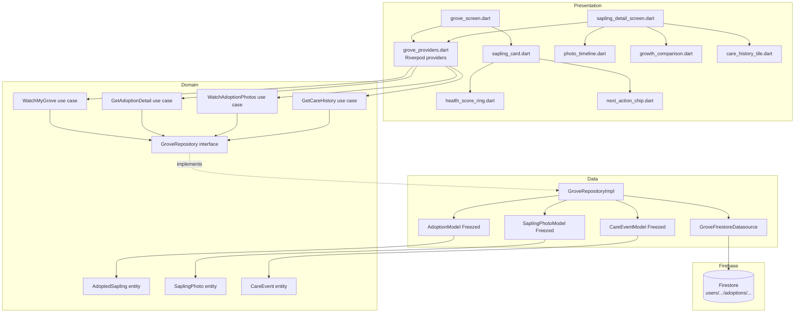

# SPEC-0002: My Grove

**Status:** APPROVED
**Author:** Architect Agent
**Date:** 2026-06-03
**Proposal:** N/A — inline with requirements
**Approved by:** Slade

---

## Overview

My Grove is the authenticated home tab (`/grove`) of the Canopy app. It gives
each user a persistent, real-time view of every tree they have adopted. The MVP
is strictly read-only: users can inspect health scores, next care actions, photo
timelines, and a first-vs-latest growth comparison, but cannot perform or log
care actions from this surface (write operations are deferred).

The feature replaces the `GroveScreen` placeholder introduced during the
boilerplate setup and adds a detail route (`/grove/sapling/:id`) inside the
existing `StatefulShellBranch` for the grove tab.

---

## Firestore schema

All grove data lives under the authenticated user's sub-tree. The adoption
document denormalizes the display fields required by the list screen so that
rendering the grove list costs exactly one collection query with no joins.

```
users/{uid}/                              ← existing user profile doc
  adoptions/{adoptionId}                  ← one doc per adopted sapling
    saplingId:        string              ← FK → saplings/{saplingId}
    nickname:         string              ← denormalized from Sapling
    species:          string              ← denormalized from Sapling
    neighborhood:     string              ← denormalized from Sapling
    colorHex:         string              ← denormalized from Sapling (#RRGGBB)
    photoUrl:         string?             ← denormalized cover/profile photo URL
    coverPhotoUrl:    string?             ← latest user-uploaded photo URL
    adoptedAt:        Timestamp
    healthScore:      int (0–100)
    nextActionAt:     Timestamp
    nextActionType:   string              ← water | fertilize | prune | inspect

    photos/{photoId}                      ← photo timeline sub-collection
      url:            string
      takenAt:        Timestamp
      note:           string?

    history/{historyId}                   ← care event log sub-collection
      type:           string              ← adopted | water | fertilize | prune | inspect
      performedAt:    Timestamp
      note:           string?
      healthScoreDelta: int?
      photoUrl:       string?
```

### Derived values (client-side, not stored)

`HealthStatus` is computed from `healthScore` at read time in the domain entity:

| healthScore | HealthStatus |
|-------------|--------------|
| >= 90       | excellent    |
| >= 70       | good         |
| >= 50       | attention    |
| < 50        | critical     |

### Composite indexes required

| Collection path                                   | Fields                          | Order |
|---------------------------------------------------|---------------------------------|-------|
| `users/{uid}/adoptions`                           | `nextActionAt` ASC              | query: list by next due |
| `users/{uid}/adoptions/{id}/photos`               | `takenAt` ASC                   | photo timeline ordering |
| `users/{uid}/adoptions/{id}/history`              | `performedAt` DESC              | care log newest-first |

These indexes must be added to `firestore.indexes.json` before deploying.

---

## Architecture



**Layer rules enforced:**

- `domain/` imports: pure Dart only. Zero `flutter`, `firebase_*`,
  `cloud_firestore`, or `riverpod` imports.
- `data/` imports: `cloud_firestore`, `freezed_annotation`, `json_serializable`,
  and domain interfaces only.
- `presentation/` imports: `flutter`, `riverpod`, `go_router`, and domain
  entities/use-case interfaces only. Never imports `data/` directly.

---

## File map

| Action         | Path                                                                                  | Responsibility                                                             |
|----------------|---------------------------------------------------------------------------------------|----------------------------------------------------------------------------|
| CREATE         | `lib/features/grove/domain/entities/adopted_sapling.dart`                            | Pure Dart entity; derives `HealthStatus` from `healthScore`                |
| CREATE         | `lib/features/grove/domain/entities/sapling_photo.dart`                              | Pure Dart entity for a single photo timeline entry                         |
| CREATE         | `lib/features/grove/domain/entities/care_event.dart`                                 | Pure Dart entity for a care history entry                                  |
| CREATE         | `lib/features/grove/domain/repositories/grove_repository.dart`                       | Abstract interface; all methods return `Stream` or `Future`                |
| CREATE         | `lib/features/grove/domain/usecases/watch_my_grove.dart`                             | Returns `Stream<List<AdoptedSapling>>` ordered by `nextActionAt`           |
| CREATE         | `lib/features/grove/domain/usecases/get_adoption_detail.dart`                        | Returns `Future<AdoptedSapling>` for a single adoption                     |
| CREATE         | `lib/features/grove/domain/usecases/watch_adoption_photos.dart`                      | Returns `Stream<List<SaplingPhoto>>` ordered by `takenAt` ASC              |
| CREATE         | `lib/features/grove/domain/usecases/get_care_history.dart`                           | Returns `Future<List<CareEvent>>` ordered by `performedAt` DESC            |
| CREATE         | `lib/features/grove/data/models/adoption_model.dart`                                 | Freezed + `fromFirestore`; maps to `AdoptedSapling`                        |
| CREATE         | `lib/features/grove/data/models/sapling_photo_model.dart`                            | Freezed + `fromFirestore`; maps to `SaplingPhoto`                          |
| CREATE         | `lib/features/grove/data/models/care_event_model.dart`                               | Freezed + `fromFirestore`; maps to `CareEvent`                             |
| CREATE         | `lib/features/grove/data/datasources/grove_firestore_datasource.dart`                | Wraps Firestore collection/stream calls; returns raw model objects         |
| CREATE         | `lib/features/grove/data/repositories/grove_repository_impl.dart`                   | Implements `GroveRepository`; translates models to entities                |
| CREATE         | `lib/features/grove/presentation/providers/grove_providers.dart`                     | `@riverpod` providers for datasource, repository, use cases, and UI state  |
| REPLACE        | `lib/features/grove/presentation/screens/grove_screen.dart`                          | Main grove list; replaces `TabPlaceholder`; uses `WatchMyGrove`            |
| CREATE         | `lib/features/grove/presentation/screens/sapling_detail_screen.dart`                 | Detail + history + photo timeline; reads `adoptionId` from route params    |
| CREATE         | `lib/features/grove/presentation/widgets/sapling_card.dart`                          | List-item card: nickname, species, `HealthScoreRing`, `NextActionChip`     |
| CREATE         | `lib/features/grove/presentation/widgets/health_score_ring.dart`                     | Circular progress ring coloured by `HealthStatus`                          |
| CREATE         | `lib/features/grove/presentation/widgets/next_action_chip.dart`                      | Pill showing icon + relative due date for next action                      |
| CREATE         | `lib/features/grove/presentation/widgets/photo_timeline.dart`                        | Horizontal scrollable list of `SaplingPhoto` thumbnails                    |
| CREATE         | `lib/features/grove/presentation/widgets/growth_comparison.dart`                     | Side-by-side first vs. latest photo; graceful empty state when < 2 photos  |
| CREATE         | `lib/features/grove/presentation/widgets/care_history_tile.dart`                     | `ListTile`-based row for a `CareEvent`                                     |
| MODIFY         | `lib/core/router/router.dart`                                                         | Add `/grove/sapling/:id` sub-route inside the grove `StatefulShellBranch`  |
| MODIFY         | `firestore.rules`                                                                     | Add read rules for `adoptions`, `photos`, and `history` sub-collections    |
| MODIFY         | `firestore.indexes.json`                                                              | Add three composite indexes (see schema section)                           |

---

## API contracts

### Domain entities

```dart
// lib/features/grove/domain/entities/adopted_sapling.dart
enum HealthStatus { excellent, good, attention, critical }
enum NextActionType { water, fertilize, prune, inspect }

class AdoptedSapling {
  const AdoptedSapling({
    required this.id,           // adoptionId (Firestore doc ID)
    required this.saplingId,
    required this.nickname,
    required this.species,
    required this.neighborhood,
    required this.colorHex,
    required this.adoptedAt,
    required this.healthScore,
    required this.nextActionAt,
    required this.nextActionType,
    this.photoUrl,
    this.coverPhotoUrl,
  });

  final String id;
  final String saplingId;
  final String nickname;
  final String species;
  final String neighborhood;
  final String colorHex;
  final DateTime adoptedAt;
  final int healthScore;          // 0–100
  final DateTime nextActionAt;
  final NextActionType nextActionType;
  final String? photoUrl;
  final String? coverPhotoUrl;

  HealthStatus get healthStatus {
    if (healthScore >= 90) return HealthStatus.excellent;
    if (healthScore >= 70) return HealthStatus.good;
    if (healthScore >= 50) return HealthStatus.attention;
    return HealthStatus.critical;
  }
}
```

```dart
// lib/features/grove/domain/entities/sapling_photo.dart
class SaplingPhoto {
  const SaplingPhoto({
    required this.id,
    required this.url,
    required this.takenAt,
    this.note,
  });

  final String id;
  final String url;
  final DateTime takenAt;
  final String? note;
}
```

```dart
// lib/features/grove/domain/entities/care_event.dart
enum CareEventType { adopted, water, fertilize, prune, inspect }

class CareEvent {
  const CareEvent({
    required this.id,
    required this.type,
    required this.performedAt,
    this.note,
    this.healthScoreDelta,
    this.photoUrl,
  });

  final String id;
  final CareEventType type;
  final DateTime performedAt;
  final String? note;
  final int? healthScoreDelta;
  final String? photoUrl;
}
```

### Repository interface

```dart
// lib/features/grove/domain/repositories/grove_repository.dart
abstract interface class GroveRepository {
  /// Emits the full list of adoptions for [uid], ordered by nextActionAt ASC.
  /// Re-emits on any document change (real-time listener).
  Stream<List<AdoptedSapling>> watchMyGrove(String uid);

  /// One-shot fetch for a single adoption document.
  Future<AdoptedSapling> getAdoptionDetail({
    required String uid,
    required String adoptionId,
  });

  /// Emits the photo timeline for one adoption, ordered by takenAt ASC.
  Stream<List<SaplingPhoto>> watchAdoptionPhotos({
    required String uid,
    required String adoptionId,
  });

  /// One-shot fetch of the care history, ordered by performedAt DESC.
  Future<List<CareEvent>> getCareHistory({
    required String uid,
    required String adoptionId,
  });
}
```

### Use case signatures

```dart
// watch_my_grove.dart
class WatchMyGrove {
  const WatchMyGrove(this._repository);
  final GroveRepository _repository;
  Stream<List<AdoptedSapling>> call(String uid) =>
      _repository.watchMyGrove(uid);
}

// get_adoption_detail.dart
class GetAdoptionDetail {
  const GetAdoptionDetail(this._repository);
  final GroveRepository _repository;
  Future<AdoptedSapling> call({
    required String uid,
    required String adoptionId,
  }) => _repository.getAdoptionDetail(uid: uid, adoptionId: adoptionId);
}

// watch_adoption_photos.dart
class WatchAdoptionPhotos {
  const WatchAdoptionPhotos(this._repository);
  final GroveRepository _repository;
  Stream<List<SaplingPhoto>> call({
    required String uid,
    required String adoptionId,
  }) => _repository.watchAdoptionPhotos(uid: uid, adoptionId: adoptionId);
}

// get_care_history.dart
class GetCareHistory {
  const GetCareHistory(this._repository);
  final GroveRepository _repository;
  Future<List<CareEvent>> call({
    required String uid,
    required String adoptionId,
  }) => _repository.getCareHistory(uid: uid, adoptionId: adoptionId);
}
```

### Riverpod provider shape (sketch — not implementation)

```dart
// grove_providers.dart (generated with @riverpod)

// Infrastructure
groveFirestoreDatasourceProvider  → GroveFirestoreDatasource
groveRepositoryProvider           → GroveRepository (keepAlive: true)

// Use-case providers
watchMyGroveProvider              → WatchMyGrove
getAdoptionDetailProvider         → GetAdoptionDetail
watchAdoptionPhotosProvider       → WatchAdoptionPhotos
getCareHistoryProvider            → GetCareHistory

// UI-state providers (AsyncNotifier / StreamNotifier)
myGroveProvider(uid)              → AsyncValue<List<AdoptedSapling>>
  └─ calls watchMyGrove.call(uid)

adoptionDetailProvider(uid, id)   → AsyncValue<AdoptedSapling>
  └─ calls getAdoptionDetail

adoptionPhotosProvider(uid, id)   → AsyncValue<List<SaplingPhoto>>
  └─ calls watchAdoptionPhotos

careHistoryProvider(uid, id)      → AsyncValue<List<CareEvent>>
  └─ calls getCareHistory
```

### Router modification

The `/grove/sapling/:id` sub-route must be declared as a child route of `/grove`
inside the existing `StatefulShellBranch`, not as a top-level `GoRoute`, so the
bottom navigation bar stays visible on the detail screen:

```dart
StatefulShellBranch(
  routes: [
    GoRoute(
      path: '/grove',
      builder: (c, s) => const GroveScreen(),
      routes: [
        GoRoute(
          path: 'sapling/:id',       // resolved as /grove/sapling/:id
          builder: (c, s) => SaplingDetailScreen(
            adoptionId: s.pathParameters['id']!,
          ),
        ),
      ],
    ),
  ],
),
```

### Firestore security rules additions

Rules must be inserted above the default-deny catch-all in `firestore.rules`.
The owner-only constraint mirrors the existing `users/{userId}` rule.

```
match /users/{userId}/adoptions/{adoptionId} {
  allow read: if request.auth != null && request.auth.uid == userId;
  allow write: if false;  // write path is out of scope for this MVP

  match /photos/{photoId} {
    allow read: if request.auth != null && request.auth.uid == userId;
    allow write: if false;
  }

  match /history/{historyId} {
    allow read: if request.auth != null && request.auth.uid == userId;
    allow write: if false;
  }
}
```

---

## Test plan

| File                                                                                          | Type    | What it covers                                                              |
|-----------------------------------------------------------------------------------------------|---------|-----------------------------------------------------------------------------|
| `test/unit/features/grove/domain/entities/adopted_sapling_test.dart`                         | unit    | `healthStatus` derivation for all four boundary values                      |
| `test/unit/features/grove/domain/usecases/watch_my_grove_test.dart`                          | unit    | Delegates to repository; stream forwarding; empty list case                 |
| `test/unit/features/grove/domain/usecases/get_adoption_detail_test.dart`                     | unit    | Delegates to repository; propagates `StateError` on missing doc             |
| `test/unit/features/grove/domain/usecases/watch_adoption_photos_test.dart`                   | unit    | Delegates; emits ordered list; empty list when no photos                    |
| `test/unit/features/grove/domain/usecases/get_care_history_test.dart`                        | unit    | Delegates; empty history case                                               |
| `test/unit/features/grove/data/models/adoption_model_test.dart`                              | unit    | `fromFirestore` round-trip; null-safe optional fields; `toEntity` mapping   |
| `test/unit/features/grove/data/models/sapling_photo_model_test.dart`                         | unit    | `fromFirestore` round-trip; null note field                                 |
| `test/unit/features/grove/data/models/care_event_model_test.dart`                            | unit    | `fromFirestore` round-trip; all `CareEventType` values; optional fields     |
| `test/unit/features/grove/data/repositories/grove_repository_impl_test.dart`                 | unit    | Datasource delegation; model-to-entity mapping; error propagation           |
| `test/widget/features/grove/presentation/screens/grove_screen_test.dart`                     | widget  | Loading state; empty grove state; list of `SaplingCard`s; navigation tap   |
| `test/widget/features/grove/presentation/screens/sapling_detail_screen_test.dart`            | widget  | Header render; `HealthScoreRing` present; photo timeline; care history list |
| `test/widget/features/grove/presentation/widgets/sapling_card_test.dart`                     | widget  | Renders nickname/species; ring color by `HealthStatus`; chip label          |
| `test/widget/features/grove/presentation/widgets/health_score_ring_test.dart`                | widget  | Score 0, 50, 70, 90, 100 render without overflow                            |
| `test/widget/features/grove/presentation/widgets/next_action_chip_test.dart`                 | widget  | Correct icon per `NextActionType`; overdue vs. future label                 |
| `test/widget/features/grove/presentation/widgets/photo_timeline_test.dart`                   | widget  | Empty state message; single photo; multiple photos horizontal scroll        |
| `test/widget/features/grove/presentation/widgets/growth_comparison_test.dart`                | widget  | < 2 photos shows placeholder; 2+ photos renders side-by-side               |
| `test/widget/features/grove/presentation/widgets/care_history_tile_test.dart`                | widget  | All `CareEventType` icons render; optional note visibility                  |

All widget tests must stub `groveRepositoryProvider` via
`ProviderScope(overrides: [...])`. Domain-layer unit tests must use only pure
Dart mocks (mockito or manual stubs) — no Flutter test runner required.

---

## Out of scope

- Performing care actions (write actions are out of scope; read-only MVP)
- Push notifications for overdue care actions
- Offline caching (Hive integration is deferred)
- Adopting a sapling from this surface (adoption flow belongs to the Discover feature)
- Editing or deleting adoption records

---

## Open questions

None — all resolved inline.
