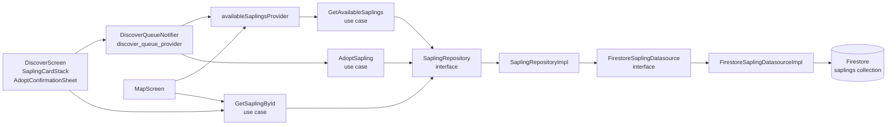

# SPEC-0002: Sapling Discovery — Swipe and Map

**Status:** APPROVED  
**Author:**  
**Date:** 2026-06-03  
**Proposal:** (no standalone proposal — scope defined in SPEC-0001 requirements doc)  
**Approved by:** Slade

---

## Overview

With authentication and onboarding in place (SPEC-0001), users need a way to discover and adopt saplings. This spec implements the core discovery surface: a swipeable card stack that presents unadopted saplings one at a time, allowing the user to swipe right to adopt or swipe left to pass, and a full-screen interactive map that pins every sapling by its hex colour. Both views share a single real-time Firestore stream filtered to `status == 'available'` saplings; the toggle between them is held in a parent-level `ValueNotifier` so switching views does not re-fetch data. Adoption is executed as an atomic Firestore transaction to prevent race conditions when two users attempt to claim the same sapling simultaneously. Anonymous (guest) users may browse and view details but are redirected to `/welcome` when they attempt to adopt, preserving the redirect param so they land back in the discovery flow after sign-up.

---

## Architecture



The Domain layer (`SaplingRepository`, all use cases, `Sapling` entity) has zero Flutter or Firebase imports. `SaplingRepositoryImpl` and `FirestoreSaplingDatasourceImpl` live in Data and carry all `cloud_firestore` references. The Presentation layer depends only on Domain interfaces — it never imports a Data class directly. `sapling_repository_provider.dart` is the single point in Presentation that wires the concrete Data implementation to the Domain interface, following the same pattern as `auth_repository_provider.dart` in SPEC-0001.

---

## File map

| Action | Path | Responsibility |
|---|---|---|
| Create | `lib/features/saplings/domain/repositories/sapling_repository.dart` | Abstract interface; pure Dart; no Firebase imports |
| Create | `lib/features/saplings/domain/usecases/get_available_saplings.dart` | Delegates to `SaplingRepository.getAvailableSaplings`; returns `Stream<List<Sapling>>` |
| Create | `lib/features/saplings/domain/usecases/get_sapling_by_id.dart` | Delegates to `SaplingRepository.getSaplingById`; returns `Future<Sapling>` |
| Create | `lib/features/saplings/domain/usecases/adopt_sapling.dart` | Delegates to `SaplingRepository.adoptSapling`; returns `Future<void>` |
| Create | `lib/features/saplings/data/datasources/firestore_sapling_datasource.dart` | Abstract interface + concrete implementation; all `cloud_firestore` calls live here; adoption uses a Firestore transaction |
| Create | `lib/features/saplings/data/repositories/sapling_repository_impl.dart` | Implements `SaplingRepository`; maps `SaplingModel` to `Sapling` via `toEntity`; delegates transaction to datasource |
| Modify | `lib/features/saplings/data/models/sapling_model.dart` | Add `adoptedAt: DateTime?` field; add `fromFirestore(DocumentSnapshot)` factory that reads the document ID separately from `data()`; update `toEntity` to pass through `adoptedAt` once `Sapling` entity gains that field |
| Create | `lib/features/saplings/presentation/providers/sapling_repository_provider.dart` | Riverpod provider wiring `FirestoreSaplingDatasourceImpl` → `SaplingRepositoryImpl` → `SaplingRepository`; follows the pattern of `auth_repository_provider.dart` |
| Create | `lib/features/saplings/presentation/providers/available_saplings_provider.dart` | `@riverpod` StreamProvider; calls `GetAvailableSaplings(ref.watch(saplingRepositoryProvider))()`; emits `AsyncValue<List<Sapling>>` |
| Create | `lib/features/saplings/presentation/providers/discover_queue_provider.dart` | `@riverpod` class `DiscoverQueueNotifier`; manages the local session queue of remaining cards, the list of passed IDs, and in-flight adoption state |
| Modify | `lib/features/discover/presentation/screens/discover_screen.dart` | Replace `TabPlaceholder` body; render `SaplingCardStack` or `MapScreen` based on `ValueNotifier<DiscoverView>`; AppBar toggle button switches the view |
| Create | `lib/features/discover/presentation/screens/sapling_detail_screen.dart` | Full-screen detail for a single sapling; reads sapling by ID via `GetSaplingById`; shows Adopt button for authenticated non-anonymous users |
| Create | `lib/features/discover/presentation/widgets/sapling_card.dart` | Single card widget showing sapling photo, nickname, species, neighborhood, and a colour accent strip derived from `colorHex`; tappable to navigate to `SaplingDetailScreen` |
| Create | `lib/features/discover/presentation/widgets/sapling_card_stack.dart` | Wraps `flutter_card_swiper`; renders the top 3 cards from `DiscoverQueueNotifier.queue` with slight offset and scale; handles swipe callbacks; shows empty-state when queue is empty |
| Create | `lib/features/discover/presentation/widgets/adopt_confirmation_sheet.dart` | Modal bottom sheet shown on successful adoption; displays the adopted sapling's nickname and a dismiss CTA |
| Modify | `lib/features/map/presentation/screens/map_screen.dart` | Replace `TabPlaceholder`; render a `flutter_map` `FlutterMap` with an OpenStreetMap tile layer and a `CircleLayer` of sapling markers coloured by `colorHex`; adopted saplings at 40% opacity; tap on marker opens `SaplingDetailScreen` |
| Modify | `firestore.rules` | Add `saplings` collection rules: authenticated read for all, restricted atomic adoption update, no client create/delete |
| Modify | `apps/mobile/pubspec.yaml` | Add `flutter_card_swiper: ^7.0.1`, `flutter_map: ^7.0.0`, `latlong2: ^0.9.1` |

---

## Firestore schema

### Collection: `saplings/{saplingId}`

One document per sapling. The document ID is the canonical `Sapling.id`. All reads and writes go through `FirestoreSaplingDatasource`. There are no sub-collections touched by this feature.

| Field | Firestore type | Dart type | Nullable | Notes |
|---|---|---|---|---|
| `nickname` | `string` | `String` | no | Display name shown on the swipe card |
| `species` | `string` | `String` | no | Common species name (e.g., `"Rain Tree"`) |
| `latin` | `string` | `String` | no | Latin binomial (e.g., `"Samanea saman"`) |
| `personality` | `string` | `String` | no | One-line personality blurb shown on the detail screen |
| `street` | `string` | `String` | no | Street address or nearest landmark |
| `neighborhood` | `string` | `String` | no | Bangkok district name matching `kNeighborhoods` |
| `lat` | `number` | `double` | no | WGS-84 latitude |
| `lng` | `number` | `double` | no | WGS-84 longitude |
| `ageLabel` | `string` | `String` | no | Human-readable age (e.g., `"~3 years"`) |
| `heightLabel` | `string` | `String` | no | Human-readable height (e.g., `"1.2 m"`) |
| `waterNeedLabel` | `string` | `String` | no | Water need descriptor (e.g., `"Moderate"`) |
| `lightLabel` | `string` | `String` | no | Sunlight requirement (e.g., `"Full sun"`) |
| `wateringIntervalDays` | `number` | `int` | no | Defaults to `3` if absent in older documents |
| `color` | `string` | `String` | no | Stored as `color` in Firestore; mapped to `colorHex` in Dart via `@JsonKey(name: 'color')`; 6-digit hex without leading `#` |
| `status` | `string` | `String` | no | `"available"` or `"adopted"`; only the adoption transaction may change this field from the client |
| `photoUrl` | `string` | `String?` | yes | HTTPS URL to a sapling photo; null until a photo is uploaded |
| `adoptedBy` | `string` | `String?` | yes | Firebase Auth UID of the adopter; null until adopted |
| `adoptedAt` | `timestamp` | `DateTime?` | yes | Set to `FieldValue.serverTimestamp()` by the adoption transaction; null until adopted; not present in older documents — `fromFirestore` must handle absence gracefully |

`healthScore` is explicitly **not** written by this spec. It is reserved for the F5 health-monitoring feature (future spec).

#### Adoption transaction

`AdoptSapling` (use case) must execute adoption as a Firestore transaction to prevent two users from adopting the same sapling simultaneously. The transaction must:

1. Read the sapling document inside the transaction.
2. Verify `data['status'] == 'available'`; if not, abort and throw a domain exception (e.g., `SaplingAlreadyAdoptedException`).
3. Write the following fields atomically in a single `transaction.update()` call:
   - `status` → `'adopted'`
   - `adoptedBy` → caller's UID
   - `adoptedAt` → `FieldValue.serverTimestamp()`

This read-check-write sequence inside a single `FirebaseFirestore.runTransaction` call guarantees that only one concurrent writer can succeed. The losing writer receives a transaction failure, which `SaplingRepositoryImpl` maps to `SaplingAlreadyAdoptedException` and surfaces as `DiscoverQueueState.adoptError`.

#### Indexes

| Collection | Fields | Order | Purpose |
|---|---|---|---|
| `saplings` | `adoptedBy` | `ASC` | Required by SPEC-0003 grove queries; add now to avoid a follow-up index deployment |

The `status` field does not need a composite index for this spec because `watchAvailableSaplings` uses a single equality filter (`where('status', isEqualTo: 'available')`), which Firestore serves without a composite index.

---

## API contracts

### `SaplingRepository` interface

```dart
// lib/features/saplings/domain/repositories/sapling_repository.dart
// Pure Dart — zero Flutter or Firebase imports.
import 'package:canopy/features/saplings/domain/entities/sapling.dart';

abstract interface class SaplingRepository {
  /// Emits the current list of available saplings and re-emits whenever
  /// the underlying Firestore query snapshot changes.
  Stream<List<Sapling>> getAvailableSaplings();

  /// Returns a single sapling by its document ID.
  /// Throws [SaplingNotFoundException] if the document does not exist.
  Future<Sapling> getSaplingById(String id);

  /// Atomically adopts the sapling identified by [saplingId].
  /// Throws [SaplingAlreadyAdoptedException] if the sapling is no longer
  /// available at transaction commit time.
  Future<void> adoptSapling({required String saplingId, required String uid});
}
```

### Use case classes

```dart
// lib/features/saplings/domain/usecases/get_available_saplings.dart
import 'package:canopy/features/saplings/domain/entities/sapling.dart';
import 'package:canopy/features/saplings/domain/repositories/sapling_repository.dart';

class GetAvailableSaplings {
  const GetAvailableSaplings(this._repository);

  final SaplingRepository _repository;

  Stream<List<Sapling>> call() => _repository.getAvailableSaplings();
}
```

```dart
// lib/features/saplings/domain/usecases/get_sapling_by_id.dart
import 'package:canopy/features/saplings/domain/entities/sapling.dart';
import 'package:canopy/features/saplings/domain/repositories/sapling_repository.dart';

class GetSaplingById {
  const GetSaplingById(this._repository);

  final SaplingRepository _repository;

  Future<Sapling> call(String id) => _repository.getSaplingById(id);
}
```

```dart
// lib/features/saplings/domain/usecases/adopt_sapling.dart
import 'package:canopy/features/saplings/domain/repositories/sapling_repository.dart';

class AdoptSapling {
  const AdoptSapling(this._repository);

  final SaplingRepository _repository;

  Future<void> call({
    required String saplingId,
    required String uid,
  }) => _repository.adoptSapling(saplingId: saplingId, uid: uid);
}
```

### `DiscoverQueueState` and `DiscoverQueueNotifier`

```dart
// lib/features/saplings/presentation/providers/discover_queue_provider.dart
import 'package:canopy/features/saplings/domain/entities/sapling.dart';
import 'package:riverpod_annotation/riverpod_annotation.dart';

part 'discover_queue_provider.g.dart';

/// Immutable snapshot of the local discovery session queue.
class DiscoverQueueState {
  const DiscoverQueueState({
    this.queue = const [],
    this.passed = const [],
    this.isAdopting = false,
    this.adoptError,
  });

  /// Remaining saplings the user has not yet swiped on this session.
  /// Populated by [DiscoverQueueNotifier.initialize] and shrinks as the
  /// user swipes. Does not include saplings the user has passed.
  final List<Sapling> queue;

  /// IDs of saplings the user swiped left on this session.
  /// Used only to filter the queue locally — nothing is written to Firestore.
  final List<String> passed;

  /// True while the Firestore adoption transaction is in flight.
  /// The card stack must disable swipe interaction while this is true.
  final bool isAdopting;

  /// Non-null when the most recent adoption transaction failed.
  /// The UI shows a snackbar with a retry option; calling [dismissError]
  /// clears this field.
  final String? adoptError;

  DiscoverQueueState copyWith({
    List<Sapling>? queue,
    List<String>? passed,
    bool? isAdopting,
    String? adoptError,
  });
}

@riverpod
class DiscoverQueueNotifier extends _$DiscoverQueueNotifier {
  @override
  DiscoverQueueState build() => const DiscoverQueueState();

  /// Seeds the queue from the Firestore stream emission. Filters out any
  /// sapling whose ID is already in [DiscoverQueueState.passed] so
  /// re-emissions from the stream do not resurface passed saplings.
  void initialize(List<Sapling> saplings);

  /// Removes [saplingId] from the queue without touching Firestore.
  /// Adds the ID to [passed] so it is excluded on the next stream emission.
  void pass(String saplingId);

  /// Runs the Firestore adoption transaction via [AdoptSapling].
  /// Sets [isAdopting] true for the duration of the transaction.
  /// On success: removes the sapling from [queue] and shows
  /// [AdoptConfirmationSheet] (caller's responsibility via returned future).
  /// On failure: sets [adoptError] with a human-readable message.
  Future<void> adopt({required String saplingId, required String uid});

  /// Clears [adoptError] after the snackbar has been shown.
  void dismissError();
}
```

### `FirestoreSaplingDatasource` interface

```dart
// lib/features/saplings/data/datasources/firestore_sapling_datasource.dart
import 'package:canopy/features/saplings/data/models/sapling_model.dart';

abstract interface class FirestoreSaplingDatasource {
  /// Returns a stream that emits every time the Firestore query snapshot for
  /// status == 'available' changes. Each emission is a full replacement list,
  /// not a diff.
  Stream<List<SaplingModel>> watchAvailableSaplings();

  /// Fetches a single sapling document by ID.
  /// Throws [SaplingNotFoundException] if the document does not exist or
  /// has been deleted.
  Future<SaplingModel> getSaplingById(String id);

  /// Runs a Firestore transaction that atomically verifies
  /// `status == 'available'` before writing `status = 'adopted'`,
  /// `adoptedBy = uid`, and `adoptedAt = FieldValue.serverTimestamp()`.
  /// Throws [SaplingAlreadyAdoptedException] if the status check fails.
  Future<void> adoptSapling({required String saplingId, required String uid});
}
```

---

## Discover UX spec

### Card stack mechanics

`SaplingCardStack` reads its data from `DiscoverQueueNotifier.queue` and renders the top three entries as a stacked deck. Cards are offset by 8 dp and scaled by 0.04 per position (second card at 0.96 scale, third at 0.92 scale) to give a physical depth effect. Only the top card is interactive.

`flutter_card_swiper` drives swipe gesture recognition. The swipe threshold is the package default; no custom threshold override is required for MVP.

- **Swipe right** — calls `DiscoverQueueNotifier.adopt(saplingId: sapling.id, uid: currentUser.id)`. While `isAdopting == true` the swipe interaction is disabled (`CardSwiper.isDisabled = true`) and a loading indicator overlays the top card. On success, `AdoptConfirmationSheet` is shown as a modal bottom sheet via `showModalBottomSheet`. On failure, `adoptError` is set and a `SnackBar` with a "Retry" action is shown; "Retry" calls `adopt` again with the same arguments.
- **Swipe left** — calls `DiscoverQueueNotifier.pass(sapling.id)`. No Firestore write occurs. The card is removed from the queue for this session; it will not reappear unless the user kills and relaunches the app (the `passed` list is in-memory only).
- **Tap without swipe** — navigates to `SaplingDetailScreen` via `GoRouter.of(context).push('/sapling/${sapling.id}')`. The `flutter_card_swiper` tap callback is used; swipe cancellation is handled by the package.
- **Empty queue** — when `queue.isEmpty`, `SaplingCardStack` renders an illustration (SVG from `assets/`) and the copy "No more saplings nearby. Check back tomorrow." with a centred layout. No swiper is rendered.

### `AdoptConfirmationSheet`

Displayed as a `DraggableScrollableSheet` or standard `ModalBottomSheet` after a successful adoption. It shows:

- The adopted sapling's `nickname` in the heading (e.g., "You've adopted Bua Luang!")
- The `species` and `neighborhood` as secondary text
- A single "Done" CTA that dismisses the sheet

The sheet has no deep-link or certificate output in this spec (out of scope per F2.8 certificate requirement).

### Anonymous user redirect

If `currentUser.isAnonymous == true` and the user taps the Adopt button on `SaplingDetailScreen` (or swipes right in `SaplingCardStack`), the app must **not** call `DiscoverQueueNotifier.adopt`. Instead it navigates to `/welcome?redirect=/sapling/${sapling.id}`. After sign-up completes, the router redirect guard (SPEC-0001, Case 3) returns the user to `SaplingDetailScreen`, where the Adopt button is available again.

---

## Map UX spec

`MapScreen` uses `flutter_map`'s `FlutterMap` widget with a `TileLayer` pointed at the OpenStreetMap tile server (`https://tile.openstreetmap.org/{z}/{x}/{y}.png`). No API key is required.

Saplings are rendered as a `CircleLayer` of `CircleMarker` objects. Each marker is positioned at `LatLng(sapling.lat, sapling.lng)` (using `latlong2`). The fill colour is parsed from `sapling.colorHex` (prepend `#` and pass to `Color(int.parse('0xFF${sapling.colorHex}'))`). Adopted saplings (`status == SaplingStatus.adopted`) render at `opacity: 0.4`; available saplings render at `opacity: 1.0`. The map shows all saplings from a single `StreamProvider` that watches the full collection (not the availability-filtered stream), so adopted saplings remain visible as grey-tinted pins.

`MapScreen` requires a separate `StreamProvider` that watches all saplings (both `available` and `adopted`). This is a second query on the `saplings` collection with no `status` filter. Define `allSaplingsProvider` alongside `availableSaplingsProvider`.

**Tap to detail:** Markers are not directly tappable in `CircleLayer`. The implementation must either:
- overlay transparent `GestureDetector` tiles aligned to marker positions using a `Stack`, or
- use a `MarkerLayer` with custom marker widgets (small coloured circles built from `Container`) that wrap a `GestureDetector`.

The simpler `MarkerLayer` approach is preferred. Each marker widget calls `GoRouter.of(context).push('/sapling/${sapling.id}')` on tap.

**View toggle:** `DiscoverScreen` owns a `ValueNotifier<DiscoverView>` (where `DiscoverView` is an enum `{ cards, map }`) declared in its `State` object (or as a `final` field if the screen is `ConsumerStatefulWidget`). The AppBar renders a `SegmentedButton` or `IconButton` that toggles between the two values. When `discoverView == DiscoverView.cards`, `SaplingCardStack` is shown; when `discoverView == DiscoverView.map`, `MapScreen` is shown in place of the card stack. Toggle state is preserved for the lifetime of the tab — it resets only when the tab is removed from the widget tree.

---

## Firestore security rules additions

Add the following block to `firestore.rules` above the default-deny catch-all, immediately after the `users` collection block:

```javascript
// ── Saplings ──────────────────────────────────────────────────────────────
// Any authenticated user (including anonymous/guest) may read sapling docs.
// Only a non-anonymous authenticated user may update a sapling, and only
// to perform a valid adoption transition. No client create or delete.
match /saplings/{saplingId} {
  allow read: if request.auth != null;

  allow update: if request.auth != null
    && request.auth.token.firebase.sign_in_provider != 'anonymous'
    && resource.data.status == 'available'
    && request.resource.data.status == 'adopted'
    && request.resource.data.adoptedBy == request.auth.uid;

  allow create: if false;
  allow delete: if false;
}
```

**Constraint rationale:**

- `read` is granted to all authenticated users (including anonymous) so guest users can browse the discovery feed and map without creating an account.
- `update` is restricted to non-anonymous users only. The rule verifies the current document has `status == 'available'` (server-side check that complements the client-side transaction), the incoming document has `status == 'adopted'`, and the `adoptedBy` field matches the caller's UID. This prevents a user from adopting a sapling on behalf of another UID.
- `create` and `delete` are denied from clients. Sapling documents are created and deleted by the admin portal (future SPEC) or by seeding scripts — never by the mobile client.

---

## Acceptance criteria

1. Available saplings load from Firestore and appear as swipeable cards in `DiscoverScreen`; the card stack reflects real-time Firestore changes (e.g., if another user adopts a sapling while this user is browsing, that card disappears on the next stream emission without requiring an app restart).
2. Swiping right atomically adopts the sapling via a Firestore transaction; if two users race to adopt the same sapling, only one succeeds and the other sees the `adoptError` snackbar with a retry option.
3. Swiping left removes the card from the session queue without any Firestore write; the sapling does not reappear within the same session.
4. Tapping a card (without completing a swipe) opens `SaplingDetailScreen`, which displays the sapling's `nickname`, `species`, `latin`, `street`, `neighborhood`, `ageLabel`, `heightLabel`, `waterNeedLabel`, `lightLabel`, and `personality`.
5. The map view renders all saplings as colour-coded markers using `colorHex`; available saplings are fully opaque and adopted saplings are at 40% opacity; tapping a marker opens `SaplingDetailScreen` for that sapling.
6. The view toggle in the `DiscoverScreen` AppBar switches between the card stack and the map; the selected view is preserved while the Discover tab remains active in the shell.
7. An anonymous (guest) user can browse the swipe queue and map and open `SaplingDetailScreen`; tapping the Adopt button redirects to `/welcome?redirect=/sapling/{id}` rather than attempting the adoption.
8. After an anonymous user completes sign-up via the redirect flow, the router returns them to `SaplingDetailScreen` (or the discover feed if the deep-link is no longer valid) without requiring manual navigation.
9. A sapling with `status: 'adopted'` never appears in the swipe queue; the `availableSaplingsProvider` stream filters only on `status == 'available'`.
10. `AdoptConfirmationSheet` is shown on successful adoption and displays the adopted sapling's `nickname` in the heading.
11. `flutter analyze` reports zero errors on all new and modified files introduced by this spec.
12. Every new screen (`sapling_detail_screen.dart`, modified `discover_screen.dart`, modified `map_screen.dart`) has a corresponding widget test.

---

## Test plan

| Test file | Type | Covers |
|---|---|---|
| `test/unit/features/saplings/domain/usecases/get_available_saplings_test.dart` | Unit | `GetAvailableSaplings.call()` delegates to `SaplingRepository.getAvailableSaplings`; mock verifies the stream is forwarded unmodified |
| `test/unit/features/saplings/domain/usecases/adopt_sapling_test.dart` | Unit | `AdoptSapling.call(saplingId:, uid:)` delegates correct arguments to `SaplingRepository.adoptSapling`; mock verifies exact named parameters |
| `test/unit/features/saplings/domain/usecases/get_sapling_by_id_test.dart` | Unit | `GetSaplingById.call(id)` delegates to `SaplingRepository.getSaplingById`; mock verifies the ID is forwarded |
| `test/unit/features/saplings/data/models/sapling_model_test.dart` | Unit | `fromFirestore` maps all fields correctly including `adoptedAt`; `adoptedAt` is null when the field is absent from the document snapshot; `toEntity` produces a `Sapling` with the correct `SaplingStatus`; unknown `status` strings fall back to `available` |
| `test/unit/features/saplings/data/repositories/sapling_repository_impl_test.dart` | Unit | `adoptSapling` triggers a Firestore transaction on the datasource; throws `SaplingAlreadyAdoptedException` when the datasource propagates a transaction failure; `getAvailableSaplings` maps each `SaplingModel` to a `Sapling` entity |
| `test/unit/features/saplings/presentation/providers/discover_queue_provider_test.dart` | Unit | `initialize` populates `queue` with the supplied saplings; `pass` removes the specified ID from `queue` and adds it to `passed`; `initialize` called a second time does not re-add IDs that are in `passed`; `adopt` sets `isAdopting = true` while in flight, removes the sapling from `queue` on success, and sets `adoptError` on failure; `dismissError` clears `adoptError` |
| `test/widget/features/discover/presentation/screens/discover_screen_test.dart` | Widget | Renders `SaplingCardStack` when `availableSaplingsProvider` emits a non-empty list; shows the empty-state copy when `queue` is empty; view toggle button switches to map mode and back |
| `test/widget/features/discover/presentation/screens/sapling_detail_screen_test.dart` | Widget | Displays `nickname`, `species`, `street`, and `neighborhood` for a given sapling; Adopt button is visible and enabled for a non-anonymous authenticated user; Adopt button (or equivalent CTA) is absent or triggers redirect for an anonymous user |
| `test/widget/features/map/presentation/screens/map_screen_test.dart` | Widget | `FlutterMap` widget is present in the tree; the correct number of marker widgets is rendered for the mocked sapling list |

---

## Out of scope

- F2.4 — filter by distance, species, or sunlight preference; follow-up spec required
- F2.7 — walking or driving directions to a sapling; requires SPEC-F9.2 maps API integration
- F2.8 — shareable adoption certificate; stretch goal, explicitly removed from this spec
- F2.9 — releasing an adopted sapling back to the pool; follow-up spec
- F2.10 — AR camera mode; stretch goal
- F3 My Grove — SPEC-0003
- F4 Watering and Care — future spec
- F5 Health monitoring and `healthScore` field — future spec; the field is explicitly omitted from the Firestore schema defined here
- Cloud Functions for server-side adoption logic; the client-side Firestore transaction is sufficient for MVP concurrency requirements
- Admin sapling upload (F8.2) — reserved for the admin portal spec; the `create` rule is deliberately denied from clients
- Distance-based sorting or geo-queries; all available saplings are returned unsorted; spatial filtering is deferred to the filter spec

---

## Open questions

- [ ] **Map package final decision:** this spec assumes `flutter_map` (OSM tiles, no API key, no billing account required). If the team has a billing-enabled Google Maps API key and prefers `google_maps_flutter` for richer marker customisation, the package substitution must be made before implementation begins. Switching after the map screen is built carries a moderate reversal cost (full rewrite of `map_screen.dart` and marker logic; `latlong2` import replaced with `google_maps_flutter`'s `LatLng`).
- [ ] **Anonymous user adoption redirect:** confirm the SPEC-0001 redirect-to-welcome flow is wired and verified end-to-end in the running app before this spec's implementation begins. The redirect param contract (`/welcome?redirect=...` → post-signup return) is a hard dependency for AC-7 and AC-8.
- [ ] **Sapling seed data:** the Flutter engineer needs at least 10 sapling documents in the development Firestore (or Firestore emulator) to validate the swipe mechanic and map markers. Confirm who is responsible for seeding this data before implementation starts and whether the emulator is configured to auto-load a seed fixture.
