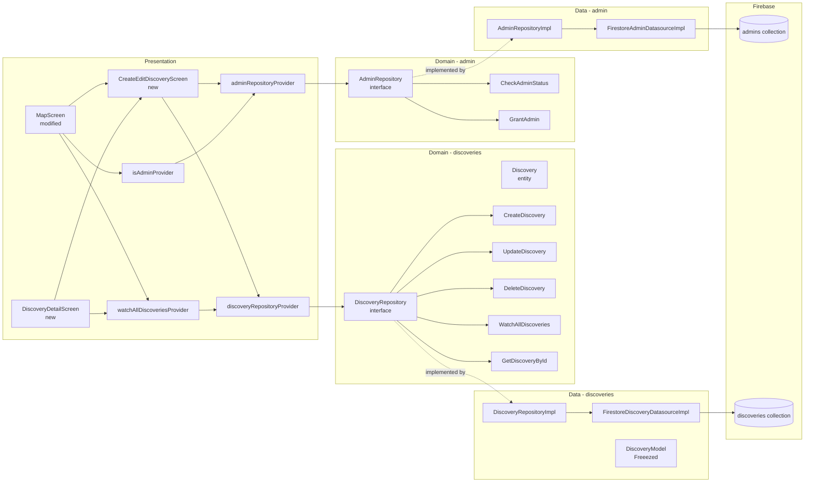

# SPEC-0003: Admin Discovery Management

**Status:** APPROVED
**Author:** Architect
**Date:** 2026-06-04
**Proposal:** [PROP-0002](../tech-proposals/0002-admin-discovery-management.md)
**Approved by:** Slade — 2026-06-04

---

## Overview

This spec introduces two new capabilities that build on the existing `map` feature. First, a top-level `admins/{userId}` Firestore collection gates all write operations on the new `discoveries` collection; every write rule performs a server-side `get()` against this collection so enforcement is independent of client code. Second, the `discoveries` collection models community points of interest (parks, community gardens, trees, etc.) with enough richness to render as a separate `MarkerLayer` on `MapScreen` and to support a detail view. Admin users see an admin-only `FloatingActionButton` on the map screen for creating new discoveries, and an overflow menu on the discovery detail screen for editing and deleting. Regular authenticated users — including anonymous guests — can read all discoveries but receive a Firestore `permission-denied` error on any write attempt. An existing admin can grant the role to another user by UID from within the app; revocation is out of scope for this version.

---

## Architecture



Domain entities and use case classes have zero Flutter or Firebase imports. The Presentation layer depends only on Domain interfaces and never imports Data classes directly. `discoveryRepositoryProvider` and `adminRepositoryProvider` are the single wiring points that bind the concrete Data implementations to Domain interfaces, following the same pattern as `sapling_repository_provider.dart`.

---

## File map

| Action | Path | Responsibility |
|---|---|---|
| **admin — domain** | | |
| Create | `lib/features/admin/domain/entities/admin_status.dart` | Pure Dart value class: holds `bool isAdmin` and the `userId` it belongs to |
| Create | `lib/features/admin/domain/repositories/admin_repository.dart` | Abstract interface: `checkAdminStatus`, `grantAdmin` |
| Create | `lib/features/admin/domain/usecases/check_admin_status.dart` | Single-responsibility use case; delegates to `AdminRepository.checkAdminStatus` |
| Create | `lib/features/admin/domain/usecases/grant_admin.dart` | Single-responsibility use case; delegates to `AdminRepository.grantAdmin` |
| **admin — data** | | |
| Create | `lib/features/admin/data/datasources/firestore_admin_datasource.dart` | Abstract interface + `FirestoreAdminDatasourceImpl`; all `cloud_firestore` calls for the `admins` collection |
| Create | `lib/features/admin/data/repositories/admin_repository_impl.dart` | Implements `AdminRepository`; delegates to the datasource |
| **admin — presentation** | | |
| Create | `lib/features/admin/presentation/providers/admin_repository_provider.dart` | Riverpod provider wiring `FirestoreAdminDatasourceImpl` → `AdminRepositoryImpl` → `AdminRepository` |
| Create | `lib/features/admin/presentation/providers/admin_repository_provider.g.dart` | Generated by `build_runner` — do not edit |
| Create | `lib/features/admin/presentation/providers/is_admin_provider.dart` | `@riverpod` `FutureProvider`; calls `CheckAdminStatus` with the current user's uid; re-evaluates on auth change |
| Create | `lib/features/admin/presentation/providers/is_admin_provider.g.dart` | Generated by `build_runner` — do not edit |
| **discoveries — domain** | | |
| Create | `lib/features/discoveries/domain/entities/discovery.dart` | Pure Dart entity class; all fields listed in the API contracts section |
| Create | `lib/features/discoveries/domain/repositories/discovery_repository.dart` | Abstract interface: all five methods listed in the API contracts section |
| Create | `lib/features/discoveries/domain/usecases/watch_all_discoveries.dart` | Delegates to `DiscoveryRepository.watchAllDiscoveries` |
| Create | `lib/features/discoveries/domain/usecases/get_discovery_by_id.dart` | Delegates to `DiscoveryRepository.getDiscoveryById` |
| Create | `lib/features/discoveries/domain/usecases/create_discovery.dart` | Delegates to `DiscoveryRepository.createDiscovery` |
| Create | `lib/features/discoveries/domain/usecases/update_discovery.dart` | Delegates to `DiscoveryRepository.updateDiscovery` |
| Create | `lib/features/discoveries/domain/usecases/delete_discovery.dart` | Delegates to `DiscoveryRepository.deleteDiscovery` |
| **discoveries — data** | | |
| Create | `lib/features/discoveries/data/models/discovery_model.dart` | Freezed + json_serializable model; `fromFirestore(DocumentSnapshot)` factory; `toEntity(String id)` method |
| Create | `lib/features/discoveries/data/models/discovery_model.freezed.dart` | Generated by `build_runner` — do not edit |
| Create | `lib/features/discoveries/data/models/discovery_model.g.dart` | Generated by `build_runner` — do not edit |
| Create | `lib/features/discoveries/data/datasources/firestore_discovery_datasource.dart` | Abstract interface + `FirestoreDiscoveryDatasourceImpl`; all `cloud_firestore` calls for the `discoveries` collection |
| Create | `lib/features/discoveries/data/repositories/discovery_repository_impl.dart` | Implements `DiscoveryRepository`; maps `DiscoveryModel` to `Discovery` via `toEntity` |
| **discoveries — presentation** | | |
| Create | `lib/features/discoveries/presentation/providers/discovery_repository_provider.dart` | Riverpod provider wiring `FirestoreDiscoveryDatasourceImpl` → `DiscoveryRepositoryImpl` → `DiscoveryRepository` |
| Create | `lib/features/discoveries/presentation/providers/discovery_repository_provider.g.dart` | Generated by `build_runner` — do not edit |
| Create | `lib/features/discoveries/presentation/providers/watch_all_discoveries_provider.dart` | `@riverpod` StreamProvider; emits `AsyncValue<List<Discovery>>`; calls `WatchAllDiscoveries` |
| Create | `lib/features/discoveries/presentation/providers/watch_all_discoveries_provider.g.dart` | Generated by `build_runner` — do not edit |
| Create | `lib/features/discoveries/presentation/screens/discovery_detail_screen.dart` | Read-only detail for a single discovery; admin overflow menu shows Edit and Delete; non-admins see the menu button but not its actions |
| Create | `lib/features/discoveries/presentation/screens/create_edit_discovery_screen.dart` | Admin-only form for creating or editing a discovery; create mode pre-fills `createdAt` and `createdBy`; edit mode receives an existing `Discovery` as an argument |
| **map — modified** | | |
| Modify | `lib/features/map/presentation/screens/map_screen.dart` | Convert `_SaplingMap` from `StatelessWidget` to `ConsumerWidget`; add a second `MarkerLayer` for discoveries using `watchAllDiscoveriesProvider`; add admin-only `FloatingActionButton` in a `Positioned` at bottom-right using `isAdminProvider`; FAB navigates to `/discovery/create` |
| **router** | | |
| Modify | `lib/core/router/router.dart` | Add top-level `GoRoute` at `/discovery/:id` (discovery detail); add top-level `GoRoute` at `/discovery/create` and `/discovery/:id/edit` (create/edit screen) |
| **Firestore** | | |
| Modify | `firestore.rules` | Add `admins/{userId}` and `discoveries/{discoveryId}` match blocks as specified in the Firestore rules section below |
| Modify | `firestore.indexes.json` | Add composite index for `discoveries` on `createdAt DESC` for ordered listing |
| **tooling** | | |
| Create | `tools/seed_admins.js` | Mirrors `seed_saplings.js`; writes `admins/{uid}` documents to the emulator for first-admin bootstrap |

---

## API contracts

### `Discovery` entity

```dart
// lib/features/discoveries/domain/entities/discovery.dart
// Pure Dart — zero Flutter or Firebase imports.

/// A community point of interest created and managed by admins.
/// Rendered as a second MarkerLayer on MapScreen alongside saplings.
class Discovery {
  const Discovery({
    required this.id,
    required this.title,
    required this.description,
    required this.category,
    required this.lat,
    required this.lng,
    required this.neighborhood,
    required this.colorHex,
    required this.createdAt,
    required this.createdBy,
    this.photoUrl,
  });

  final String id;

  /// Short display title shown on the marker callout and detail screen.
  final String title;

  /// Long-form description shown on the detail screen.
  final String description;

  /// Category string, e.g. "tree", "park", "community garden".
  final String category;

  /// WGS-84 latitude.
  final double lat;

  /// WGS-84 longitude.
  final double lng;

  /// Bangkok district name matching kNeighborhoods.
  final String neighborhood;

  /// 6-digit hex colour without leading '#', used to tint the map marker.
  /// Parse with: Color(int.parse('0xFF$colorHex'))
  final String colorHex;

  /// Server timestamp of document creation.
  final DateTime createdAt;

  /// Firebase Auth UID of the admin who created this discovery.
  final String createdBy;

  /// Optional HTTPS URL to a representative photo.
  final String? photoUrl;
}
```

### `DiscoveryRepository` interface

```dart
// lib/features/discoveries/domain/repositories/discovery_repository.dart
// Pure Dart — zero Flutter or Firebase imports.
import 'package:canopy/features/discoveries/domain/entities/discovery.dart';

abstract interface class DiscoveryRepository {
  /// Emits the full list of discoveries and re-emits on any Firestore change.
  /// All authenticated users (including anonymous) may call this.
  Stream<List<Discovery>> watchAllDiscoveries();

  /// Fetches a single discovery document by ID.
  /// Throws [DiscoveryNotFoundException] if the document does not exist.
  Future<Discovery> getDiscoveryById(String id);

  /// Creates a new discovery document. Caller must be an admin; the
  /// Firestore rule enforces this server-side via get() on admins/{uid}.
  /// Returns the Firestore-assigned document ID of the created discovery.
  Future<String> createDiscovery(Discovery discovery);

  /// Replaces the mutable fields of an existing discovery document.
  /// Caller must be an admin; enforced server-side.
  Future<void> updateDiscovery(Discovery discovery);

  /// Deletes a discovery document by ID.
  /// Caller must be an admin; enforced server-side.
  Future<void> deleteDiscovery(String id);
}
```

### `AdminRepository` interface

```dart
// lib/features/admin/domain/repositories/admin_repository.dart
// Pure Dart — zero Flutter or Firebase imports.

abstract interface class AdminRepository {
  /// Returns true if an admins/{uid} document exists with isAdmin == true.
  /// Returns false (rather than throwing) when the document is absent, so the
  /// caller can treat absence as non-admin without special error handling.
  Future<bool> checkAdminStatus(String uid);

  /// Creates admins/{targetUid} = { isAdmin: true }.
  /// The calling user must already be an admin; Firestore rules enforce this.
  /// Throws [PermissionDeniedException] if the caller is not an admin.
  Future<void> grantAdmin(String targetUid);
}
```

### `AdminStatus` entity

```dart
// lib/features/admin/domain/entities/admin_status.dart
// Pure Dart — zero Flutter or Firebase imports.

/// Carries the resolved admin state for a given user.
class AdminStatus {
  const AdminStatus({required this.userId, required this.isAdmin});

  final String userId;
  final bool isAdmin;

  static const AdminStatus notAdmin = AdminStatus(userId: '', isAdmin: false);
}
```

### Use case signatures

```dart
// lib/features/admin/domain/usecases/check_admin_status.dart
import 'package:canopy/features/admin/domain/repositories/admin_repository.dart';

class CheckAdminStatus {
  const CheckAdminStatus(this._repository);
  final AdminRepository _repository;

  /// Returns true if [uid] is an admin, false otherwise.
  Future<bool> call(String uid);
}
```

```dart
// lib/features/admin/domain/usecases/grant_admin.dart
import 'package:canopy/features/admin/domain/repositories/admin_repository.dart';

class GrantAdmin {
  const GrantAdmin(this._repository);
  final AdminRepository _repository;

  /// Creates the admins/{targetUid} document for [targetUid].
  /// Requires the calling Firestore session to belong to an existing admin.
  Future<void> call(String targetUid);
}
```

```dart
// lib/features/discoveries/domain/usecases/watch_all_discoveries.dart
import 'package:canopy/features/discoveries/domain/entities/discovery.dart';
import 'package:canopy/features/discoveries/domain/repositories/discovery_repository.dart';

class WatchAllDiscoveries {
  const WatchAllDiscoveries(this._repository);
  final DiscoveryRepository _repository;

  Stream<List<Discovery>> call();
}
```

```dart
// lib/features/discoveries/domain/usecases/get_discovery_by_id.dart
import 'package:canopy/features/discoveries/domain/entities/discovery.dart';
import 'package:canopy/features/discoveries/domain/repositories/discovery_repository.dart';

class GetDiscoveryById {
  const GetDiscoveryById(this._repository);
  final DiscoveryRepository _repository;

  Future<Discovery> call(String id);
}
```

```dart
// lib/features/discoveries/domain/usecases/create_discovery.dart
import 'package:canopy/features/discoveries/domain/entities/discovery.dart';
import 'package:canopy/features/discoveries/domain/repositories/discovery_repository.dart';

class CreateDiscovery {
  const CreateDiscovery(this._repository);
  final DiscoveryRepository _repository;

  /// Returns the new document ID assigned by Firestore.
  Future<String> call(Discovery discovery);
}
```

```dart
// lib/features/discoveries/domain/usecases/update_discovery.dart
import 'package:canopy/features/discoveries/domain/entities/discovery.dart';
import 'package:canopy/features/discoveries/domain/repositories/discovery_repository.dart';

class UpdateDiscovery {
  const UpdateDiscovery(this._repository);
  final DiscoveryRepository _repository;

  Future<void> call(Discovery discovery);
}
```

```dart
// lib/features/discoveries/domain/usecases/delete_discovery.dart
import 'package:canopy/features/discoveries/domain/repositories/discovery_repository.dart';

class DeleteDiscovery {
  const DeleteDiscovery(this._repository);
  final DiscoveryRepository _repository;

  Future<void> call(String id);
}
```

### Provider signatures

```dart
// lib/features/admin/presentation/providers/is_admin_provider.dart
import 'package:riverpod_annotation/riverpod_annotation.dart';

part 'is_admin_provider.g.dart';

/// Resolves to true if the currently signed-in user has an admins/{uid}
/// document with isAdmin == true.  Returns false while loading or when no
/// user is signed in.  The provider re-evaluates when authStateProvider emits.
@riverpod
Future<bool> isAdmin(Ref ref);
```

```dart
// lib/features/discoveries/presentation/providers/watch_all_discoveries_provider.dart
import 'package:canopy/features/discoveries/domain/entities/discovery.dart';
import 'package:riverpod_annotation/riverpod_annotation.dart';

part 'watch_all_discoveries_provider.g.dart';

/// Live stream of all discovery documents ordered by createdAt descending.
/// Emits AsyncValue<List<Discovery>>; re-emits on any Firestore snapshot change.
@riverpod
Stream<List<Discovery>> watchAllDiscoveries(Ref ref);
```

---

## Firestore schema

### Collection: `admins/{userId}`

The document ID is the Firebase Auth UID of the admin user. The collection is append-only from clients (no client delete or update). The very first document must be bootstrapped via `tools/seed_admins.js` (emulator) or a manual Firebase Console step (production — documented in `SETUP.md`).

```jsonc
// admins/{userId}
{
  "isAdmin": true    // boolean — always true; absence of the document means not-admin
}
```

| Field | Firestore type | Dart type | Nullable | Notes |
|---|---|---|---|---|
| `isAdmin` | `boolean` | `bool` | no | Always `true`; the field exists as a signal and for rule readability. Document non-existence is treated as `isAdmin == false` by both the app and rules. |

### Collection: `discoveries/{discoveryId}`

The document ID is auto-assigned by Firestore on `add()`. All fields except `photoUrl` are required.

```jsonc
// discoveries/{discoveryId}
{
  "title":        "Lumphini Community Garden",   // string
  "description":  "A volunteer-run garden open on weekends. Composting station on-site.", // string
  "category":     "community garden",            // string — e.g. "tree", "park", "community garden"
  "lat":          13.7282,                       // number (double)
  "lng":          100.5418,                      // number (double)
  "neighborhood": "Lumphini",                    // string — matches kNeighborhoods
  "colorHex":     "4A7C59",                      // string — 6-digit hex without '#'
  "photoUrl":     "https://example.com/img.jpg", // string | null — absent if not set
  "createdAt":    /* Timestamp */,               // timestamp — FieldValue.serverTimestamp() on create
  "createdBy":    "uid-of-creating-admin"        // string — Firebase Auth UID
}
```

| Field | Firestore type | Dart type | Nullable | Notes |
|---|---|---|---|---|
| `title` | `string` | `String` | no | Short display name for the map callout |
| `description` | `string` | `String` | no | Long-form detail text |
| `category` | `string` | `String` | no | Free-text category tag; no enum constraint in schema |
| `lat` | `number` | `double` | no | WGS-84 latitude |
| `lng` | `number` | `double` | no | WGS-84 longitude |
| `neighborhood` | `string` | `String` | no | Bangkok district name |
| `colorHex` | `string` | `String` | no | 6-digit hex without `#`; parse as `Color(int.parse('0xFF$colorHex'))` |
| `photoUrl` | `string` | `String?` | yes | HTTPS URL; absent when no photo has been attached |
| `createdAt` | `timestamp` | `DateTime` | no | Set by `FieldValue.serverTimestamp()` on document creation; never updated |
| `createdBy` | `string` | `String` | no | UID of the creating admin |

`updatedAt` and `updatedBy` are explicitly absent in v1 (last-write-wins, no conflict detection). Add them in a follow-up spec if audit requirements change.

---

## Firestore rules additions

Add the following two blocks to `firestore.rules` above the default-deny catch-all and below the existing `users/{userId}/adoptions` block:

```javascript
// ── Admins ────────────────────────────────────────────────────────────────
// The admins collection is the source of truth for the admin role.
// Only an existing admin can grant the role to another user (by writing a new
// document).  No client may update or delete an admin document.
// The first admin document must be bootstrapped via seed script or Console.
match /admins/{userId} {
  // Any authenticated user may check whether a specific uid is an admin.
  // This is required so the app can show/hide admin UI without a Cloud
  // Function.  The read leaks the existence of admin accounts — acceptable
  // for a team-operated app.
  allow read: if request.auth != null;

  // Only an existing admin may create a new admin document.
  // The target document ID must match the field value (no spoofing).
  allow create: if request.auth != null
    && get(/databases/$(database)/documents/admins/$(request.auth.uid)).data.isAdmin == true
    && request.resource.data.isAdmin == true;

  // No client updates or deletes. Revocation requires a Console operation
  // or a follow-up spec.
  allow update: if false;
  allow delete: if false;
}

// ── Discoveries ───────────────────────────────────────────────────────────
// Points of interest created and managed by admins.
// All authenticated users (including anonymous/guest) can read.
// Only admins may create, update, or delete.
match /discoveries/{discoveryId} {
  allow read: if request.auth != null;

  allow create: if request.auth != null
    && get(/databases/$(database)/documents/admins/$(request.auth.uid)).data.isAdmin == true
    && request.resource.data.createdBy == request.auth.uid;

  allow update: if request.auth != null
    && get(/databases/$(database)/documents/admins/$(request.auth.uid)).data.isAdmin == true;

  allow delete: if request.auth != null
    && get(/databases/$(database)/documents/admins/$(request.auth.uid)).data.isAdmin == true;
}
```

**Rule rationale:**

- `admins` `read` is granted to all authenticated users so the app can evaluate `isAdminProvider` without a Cloud Function. The information leaked (that a uid is an admin) is acceptable for a team-operated app.
- `admins` `create` uses a `get()` on the caller's own document to verify they are already an admin before they can write a new admin grant. This is the only server-side enforcement of the "only admins can grant admins" rule.
- `discoveries` `create` additionally asserts `createdBy == request.auth.uid` to prevent an admin from attributing a discovery to another user.
- `discoveries` `update` and `delete` require only the admin check; the `createdBy` field is not required to match because any admin may edit or delete any discovery.
- No client rule touches `admins` `update` or `delete` — revocation is a Console-only operation in this version.

---

## `firestore.indexes.json` addition

Add the following entry to the `indexes` array in `firestore.indexes.json`:

```json
{
  "collectionGroup": "discoveries",
  "queryScope": "COLLECTION",
  "fields": [
    { "fieldPath": "createdAt", "order": "DESCENDING" }
  ]
}
```

This single-field index supports the `watchAllDiscoveries` query ordered by `createdAt DESC`. Firestore does not auto-create single-field descending indexes for all collections; declaring it explicitly ensures the index exists before the emulator or production query runs.

---

## Test plan

| Test file path | What it covers |
|---|---|
| `test/unit/features/admin/domain/usecases/check_admin_status_test.dart` | `CheckAdminStatus.call(uid)` delegates to `AdminRepository.checkAdminStatus`; mock returns true for admin uid, false for non-admin uid |
| `test/unit/features/admin/domain/usecases/grant_admin_test.dart` | `GrantAdmin.call(targetUid)` delegates correct uid to `AdminRepository.grantAdmin`; mock verifies exact argument |
| `test/unit/features/admin/data/repositories/admin_repository_impl_test.dart` | `checkAdminStatus` returns true when datasource finds a document, false when absent; `grantAdmin` calls datasource `createAdminDocument` with correct uid |
| `test/unit/features/discoveries/domain/usecases/watch_all_discoveries_test.dart` | `WatchAllDiscoveries.call()` forwards the stream from `DiscoveryRepository`; mock verifies stream emissions pass through unmodified |
| `test/unit/features/discoveries/domain/usecases/create_discovery_test.dart` | `CreateDiscovery.call(discovery)` delegates to `DiscoveryRepository.createDiscovery`; mock verifies the `Discovery` object is forwarded |
| `test/unit/features/discoveries/domain/usecases/update_discovery_test.dart` | `UpdateDiscovery.call(discovery)` delegates to `DiscoveryRepository.updateDiscovery`; mock verifies the updated `Discovery` is forwarded |
| `test/unit/features/discoveries/domain/usecases/delete_discovery_test.dart` | `DeleteDiscovery.call(id)` delegates to `DiscoveryRepository.deleteDiscovery`; mock verifies the correct id is forwarded |
| `test/unit/features/discoveries/data/models/discovery_model_test.dart` | `fromFirestore` maps all required fields; `photoUrl` is null when absent from snapshot; `toEntity` produces a `Discovery` with the correct `colorHex` and `createdAt`; missing required fields throw a `TypeError` |
| `test/unit/features/discoveries/data/repositories/discovery_repository_impl_test.dart` | `watchAllDiscoveries` maps each `DiscoveryModel` to a `Discovery` entity via `toEntity`; `createDiscovery` passes through the returned document id; `deleteDiscovery` calls datasource with the correct id |
| `test/widget/features/discoveries/presentation/screens/discovery_detail_screen_test.dart` | Displays `title`, `description`, `category`, and `neighborhood` for a given discovery; admin user sees the three-dot overflow menu with Edit and Delete actions; non-admin user does not see Edit or Delete; Delete triggers a confirmation dialog before calling the use case |
| `test/widget/features/discoveries/presentation/screens/create_edit_discovery_screen_test.dart` | Create mode renders an empty form and calls `CreateDiscovery` on submit with valid inputs; edit mode pre-fills the form with the existing `Discovery` fields; validation rejects empty `title`; submit button is disabled while the create/update call is in flight |
| `test/widget/features/map/presentation/screens/map_screen_test.dart` | Discovery `MarkerLayer` renders the correct number of marker widgets when `watchAllDiscoveriesProvider` emits a non-empty list; admin user sees the FAB; non-admin user does not see the FAB; FAB tap navigates to `/discovery/create` |
| `test/widget/features/admin/presentation/providers/is_admin_provider_test.dart` | Provider resolves to true when `checkAdminStatus` returns true; resolves to false when it returns false; resolves to false when no user is signed in |

---

## Out of scope

- **Admin revocation.** Removing an `admins/{uid}` document to revoke the role is a Console-only operation in v1. A follow-up spec must add `revokeAdmin` to `AdminRepository` and a corresponding rule update.
- **Discovery media upload.** `photoUrl` is stored as a plain HTTPS string. Uploading images via Firebase Storage is a separate feature requiring `firebase_storage` and its own security rules.
- **Draft/published state.** All created discoveries are immediately visible. A `status` field and the rule changes to differentiate admin-visible drafts from published documents are deferred.
- **Conflict detection.** Last-write-wins. No `updatedAt` field, no Firestore transactions, no optimistic locking in v1.
- **Admin web dashboard or back-office portal.** In-app mobile management is the only surface in scope.
- **Fine-grained role tiers.** A single binary `isAdmin` flag is sufficient. Moderator/super-admin tiers are out of scope.
- **Push notifications** when a new discovery is published.
- **Audit logging** (`updatedAt`, `updatedBy`) of who modified a discovery.
- **Spatial/geo queries.** All discoveries are returned by `watchAllDiscoveries` without geographic filtering. Distance-based filtering is deferred.
- **Discovery-to-sapling associations.** A discovery does not reference any sapling document. The two `MarkerLayer`s are independent.
- **Anonymous user adoption redirect.** Discoveries are read-only for all non-admin users; no redirect flow is needed.

---

## Open questions

All questions are reproduced from PROP-0002. Resolutions are marked where the user provided answers; remaining items are marked DEFERRED.

| # | Question | Resolution |
|---|---|---|
| 1 | First admin bootstrap mechanism | RESOLVED — emulator: `tools/seed_admins.js` seed script; production: manual Firebase Console step documented in `SETUP.md`. |
| 2 | Admin revocation in scope? | RESOLVED — revocation is explicitly out of scope for this spec. A Console delete of `admins/{uid}` is the supported path until a follow-up spec is written. |
| 3 | Discovery data model / schema | RESOLVED — fields defined as: `title` (string), `description` (string), `category` (string), `lat` (double), `lng` (double), `neighborhood` (string), `colorHex` (6-digit hex without `#`), `photoUrl` (string, optional), `createdAt` (Timestamp), `createdBy` (uid string). Schema section above is the normative definition. |
| 4 | Discovery read visibility | RESOLVED — all authenticated users including anonymous/guest can read all discoveries. Same pattern as the `saplings` collection. |
| 5 | Relation to saplings and rendering architecture | RESOLVED — discoveries render as a separate `MarkerLayer` on `MapScreen` alongside the existing sapling `MarkerLayer`. No sapling reference or shared marker logic. |
| 6 | Concurrent admin sessions / conflict detection | RESOLVED — last-write-wins is acceptable for MVP. No optimistic locking. |
| 7 | Draft vs. published state | RESOLVED — no draft state in v1. Every created discovery is immediately visible. No `status` field. |
