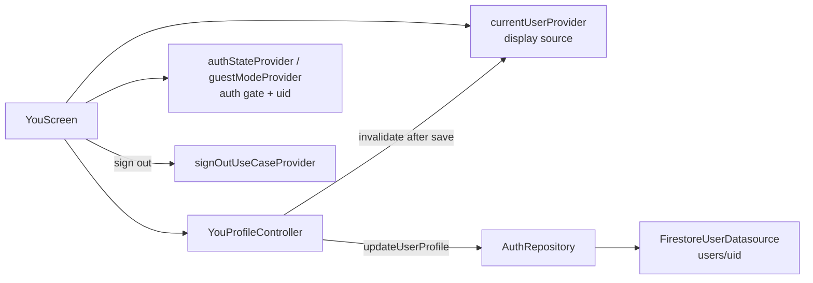

# SPEC-0003: You Profile

**Status:** REVIEW
**Author:** bambi
**Date:** 2026-06-04
**Proposal:** [PROP-0002](../tech-proposals/0002-you-profile.md)
**Approved by:** (fill in when approved)

---

## Overview

Replace the You tab placeholder with a profile screen implementing F1.6. The
feature is presentation-only: it consumes the auth feature's existing
`AppUser` entity, `updateUserProfile` repository method, and providers. A new
`YouProfileController` orchestrates saves and refreshes `currentUserProvider`
(the `authStateChanges` stream does not re-emit on Firestore document writes,
so profile display data is read from `currentUserProvider` and invalidated
after each save). Guests see a create-account prompt mirroring the Discover
guest gate.

## Architecture



## File map

| Action | Path | Responsibility |
|---|---|---|
| Create | `lib/features/you/presentation/providers/you_profile_provider.dart` | `YouProfileController` — `{isSaving, error}` state, per-field save methods |
| Create | `lib/features/you/presentation/widgets/profile_header.dart` | Avatar (photoUrl / initials fallback), name, email |
| Create | `lib/features/you/presentation/widgets/profile_field_row.dart` | Tappable label/value row; "Not set" muted empty state |
| Create | `lib/features/you/presentation/widgets/edit_name_sheet.dart` | Bottom sheet with text field, returns trimmed name |
| Create | `lib/features/you/presentation/widgets/select_option_sheet.dart` | Generic single-select bottom sheet (neighborhood / frequency / experience) |
| Create | `lib/features/you/presentation/widgets/guest_profile_prompt.dart` | Guest empty state → `/welcome?redirect=/you` |
| Modify | `lib/features/you/presentation/screens/you_screen.dart` | Replace `TabPlaceholder` with the profile screen |
| Modify | `test/unit/auth/fakes/fake_firestore_user_datasource.dart` | Capture `name` and `notificationPreferences` updates |

No router changes: `/you` already resolves to `YouScreen`. No new dependencies.
No Firestore rules changes: owner update of `users/{userId}` is already allowed.

## API contracts

```dart
// you_profile_provider.dart
class YouProfileEditState {
  const YouProfileEditState({this.isSaving = false, this.error});
  final bool isSaving;
  final String? error;
}

@riverpod
class YouProfileController extends _$YouProfileController {
  @override
  YouProfileEditState build();

  Future<void> updateName(String uid, String name);
  Future<void> updateNeighborhood(String uid, String neighborhood);
  Future<void> updateFrequency(String uid, CheckInFrequency frequency);
  Future<void> updateExperience(String uid, PlantExperience experience);
  Future<void> updateNotifications(String uid, NotificationPreferences prefs);
}
```

Each method sets `isSaving`, calls
`authRepository.updateUserProfile(uid: uid, <field>: value)` (other fields null
= unchanged), invalidates `currentUserProvider` on success, and sets `error`
on failure. The screen surfaces `error` via `ref.listen` → `SnackBar` and
disables controls while `isSaving`.

## UX spec

- **Auth gate:** `authStateProvider.when` — loading → spinner; error → retry
  message; `user == null || user.isAnonymous || guestMode` → `GuestProfilePrompt`.
- **Header:** `CircleAvatar` with `photoUrl` when present, else initials
  derived from `name`; name + email below (read-only).
- **Field rows:** Name, Neighborhood (`kNeighborhoods`), Check-in frequency
  (`CheckInFrequency.values` labels), Plant experience
  (`PlantExperience.values` labels). Tap → bottom sheet; null → "Not set".
- **Notifications:** `SwitchListTile` × 2 (Watering reminders, City alerts);
  toggling saves immediately via `NotificationPreferences.copyWith`.
- **Sign out:** button → existing `confirmSignOut(context)` dialog → on
  confirm, `signOutUseCaseProvider`; the router redirect handles navigation.
- All colors via `ColorScheme` / `AppColors` extension, text via `textTheme`,
  package imports only.

## Test plan

| Test file | Covers |
|---|---|
| `test/unit/you/you_profile_provider_test.dart` | Each update method passes the correct field + uid to the datasource (captured via `FakeFirestoreUserDatasource`); `isSaving` transitions; `error` set on failure and cleared on next save |
| `test/widget/you/you_screen_test.dart` | Authenticated render: header (name/email/initials), field rows with values and "Not set", both toggles, sign-out button + confirm dialog; guest render: create-account prompt, no edit rows; loading state |

## Out of scope

- Avatar upload (F1.7) — needs `firebase_storage` + `image_picker`.
- Account deletion (F1.8) — needs re-auth and cascading data cleanup.
- Password reset / email change.
- Theme switching UI.

## Open questions

- [ ] Extract a shared `SelectableOptionTile` used by both onboarding steps and
      `select_option_sheet.dart` (deferred refactor — onboarding files are
      stable on `main`; avoid conflict risk in this PR).
