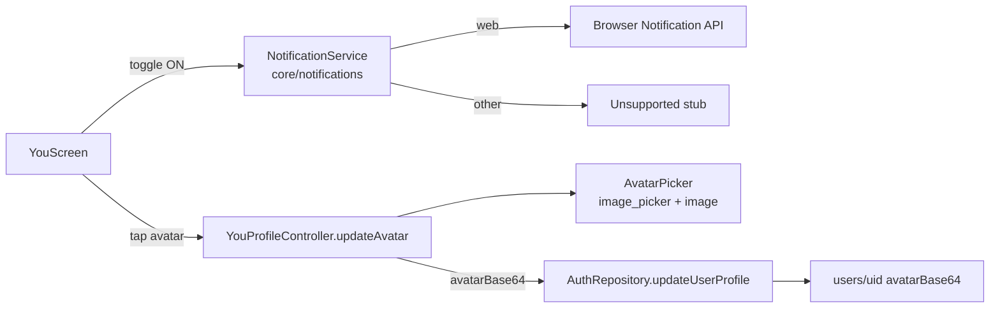

# SPEC-0004: Avatar Upload & Notification Permissions

**Status:** REVIEW
**Author:** bambi
**Date:** 2026-06-05
**Proposal:** [PROP-0004](../tech-proposals/0004-avatar-and-notifications.md)
**Approved by:** (fill in when approved)

---

## Overview

Extends the You profile (SPEC-0003) with F1.7 avatar upload and observable
notification toggles. Avatars are compressed client-side to a 256px JPEG and
stored base64 in the user doc (no Firebase Storage — Blaze unavailable);
notification toggles gate on real browser permission and fire a confirmation
notification.

## Architecture



## File map

| Action | Path | Responsibility |
|---|---|---|
| Create | `lib/core/notifications/notification_service.dart` | Facade + conditional-import factory |
| Create | `lib/core/notifications/notification_service_web.dart` | Browser Notification API impl (`package:web`) |
| Create | `lib/core/notifications/notification_service_stub.dart` | Unsupported fallback (Android/iOS follow-up) |
| Create | `lib/core/notifications/notification_service_provider.dart` | keepAlive Riverpod provider |
| Create | `lib/features/you/presentation/services/avatar_picker.dart` | Pick → 256px square JPEG → base64; provider |
| Modify | `lib/features/auth/domain/entities/app_user.dart` | `avatarBase64` field |
| Modify | `lib/features/auth/data/models/app_user_model.dart` | Serialize `avatarBase64` |
| Modify | `updateUserProfile` chain (datasource → repo interface/impl → usecase) | `avatarBase64` param |
| Modify | `lib/features/you/presentation/providers/you_profile_provider.dart` | `updateAvatar(uid)` |
| Modify | `lib/features/you/presentation/widgets/profile_header.dart` | MemoryImage precedence, camera badge, `onEditAvatar` |
| Modify | `lib/features/you/presentation/screens/you_screen.dart` | `_toggleNotification` permission flow |
| Modify | `firestore.rules` | Cap `avatarBase64` < 131072 bytes |

New dependencies: `image_picker`, `image`, `web`.

## API contracts

```dart
// core/notifications/notification_service.dart
abstract class NotificationService {
  bool get isSupported;
  Future<bool> requestPermission();
  Future<void> show({required String title, required String body});
}

// features/you/presentation/services/avatar_picker.dart
class AvatarPicker {
  Future<String?> pickAndEncode(); // base64 256px JPEG, null on cancel
}

// YouProfileController addition
Future<void> updateAvatar(String uid);
```

Toggle-ON flow: `requestPermission()` → denied: snackbar, no save → granted:
`updateNotifications(...)` → on success `show(confirmation)`. Toggle-OFF
saves directly. Avatar display precedence: `avatarBase64` → `photoUrl` →
initials.

## Test plan

| Test file | Covers |
|---|---|
| `test/unit/you/you_profile_provider_test.dart` | updateAvatar saves encoded result; cancel = no-op; picker throw sets error |
| `test/widget/you/you_screen_test.dart` | Toggle ON: permission + save + confirmation; denied: snackbar, no save; toggle OFF: no permission request; camera badge renders; avatar tap → picker → save; cancel saves nothing |

## Out of scope

- Firebase Storage migration (needs Blaze) — revisit with PM.
- Android/iOS local notifications (`flutter_local_notifications`).
- Actual scheduled watering reminders — feature 3.4 owns scheduling/weather.
- Propagating avatar changes to denormalized `adoptedByPhotoUrl` on saplings.

## Open questions

- [ ] Should `adoptedByPhotoUrl` denormalization be refreshed on avatar
      change (batched write across adopted saplings)?
